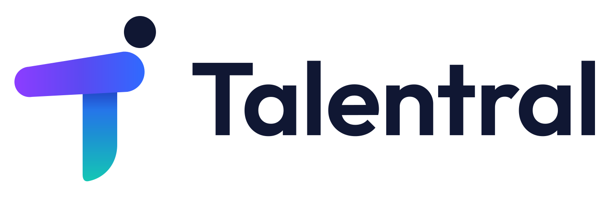
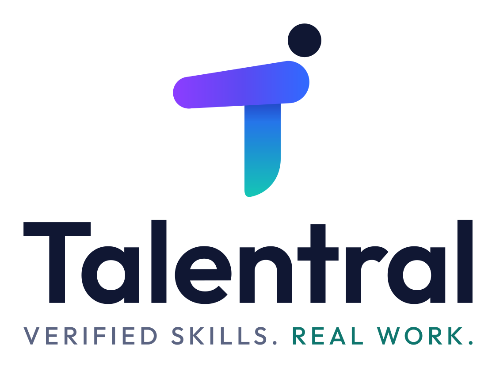
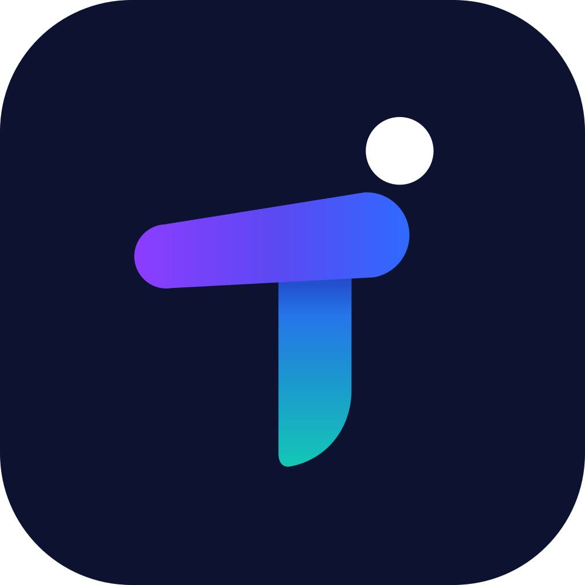

<p></p>

# Talentral brand

The full guide is **[talentral-brand-guide.pdf](talentral-brand-guide.pdf)** (10 pages: idea, logo system, clear space, misuse, colour, typography, interface foundations, voice, applications). This page is the quick reference.

## The mark

A person with open arms forms the **T** of Talentral. The dot is the head, a step ahead of the arms, the way a person moves forward into opportunity. The gradient is the journey the platform exists for: **violet** for learning, **blue** for proof, **teal** for work.

The mark refines the June 2026 founding-partner identity. It keeps the gradient T-figure and the head, redrawn as exact vector geometry (a tapered, slightly lifted arm and a curved stem with a soft fold shadow) so it holds up from a 16 px favicon to signage. The wordmark is set in Outfit SemiBold and converted to outlines.

| Horizontal | Stacked | App icon |
| --- | --- | --- |
|  |  |  |

## Files

All logo files are in [`logo/`](logo). PNG exports of every file are in [`logo/png/`](logo/png), named `<file>-<width>.png`.

| Use | Light backgrounds | Dark backgrounds |
| --- | --- | --- |
| Horizontal (primary) | `talentral-logo-horizontal.svg` | `talentral-logo-horizontal-dark.svg` |
| Stacked with tagline | `talentral-logo-stacked.svg` | `talentral-logo-stacked-dark.svg` |
| Stacked, no tagline | `talentral-logo-stacked-no-tagline.svg` | `talentral-logo-stacked-no-tagline-dark.svg` |
| Mark | `talentral-mark.svg` | `talentral-mark-dark.svg` |
| One colour | `talentral-logo-horizontal-mono-ink.svg`, `talentral-mark-mono-ink.svg` | `talentral-logo-horizontal-mono-white.svg`, `talentral-mark-mono-white.svg` |
| Wordmark only | `talentral-wordmark.svg` | `talentral-wordmark-dark.svg` |
| App icon and favicon | `talentral-app-icon.svg`, `favicon.ico` (16, 32, 48), `apple-touch-icon.png` (180) | |
| Link preview | `talentral-social-card.svg` (1200 x 630) | |

## Rules

- **Clear space:** at least the diameter of the dot on every side.
- **Minimum size:** horizontal 120 px (30 mm); stacked with tagline 160 px (40 mm); stacked without tagline 96 px (24 mm); mark or app icon 16 px (8 mm).
- **Backgrounds:** primary logo on White or Canvas; the dark version on Midnight; the one-colour white version on Blue or photography with a Midnight overlay.
- **Never** stretch, recolour, rotate, add effects to, or rearrange the logo, and never move or remove the dot.

## Colour

| Name | Hex | Role | Contrast |
| --- | --- | --- | --- |
| Midnight | `#0D1230` | Dark brand surfaces, covers, app icon | White text 18.3:1 |
| Ink | `#101733` | Headings and body text on light | 17.6:1 on white |
| Blue | `#2E5BFF` | Primary actions, links, focus | 5.2:1 on white |
| Violet | `#7C3AED` | Section labels, highlights | 5.7:1 on white |
| Teal | `#14B8A6` | Emphasis on dark; decoration only on light | 7.4:1 on Midnight, 2.5:1 on white |
| Teal 700 | `#0F766E` | Success text on light | 5.5:1 on white |
| Indigo, Sky | `#5B49F2`, `#1D8FD4` | Gradient and illustration | |
| Muted | `#5B6482` | Secondary text on light | 5.8:1 on white |
| Mist | `#C7CCE0` | Secondary text on dark | 11.5:1 on Midnight |
| Line, Canvas | `#E3E7F2`, `#F7F8FC` | Borders; app background | |

**Journey gradient:** `#7C3AED → #2E5BFF → #14B8A6` at 90°. Use it for brand moments only (the mark, hero bars, covers, dividers). Interface controls use solid Blue. Text is never set in the gradient.

## Typography

| Style | Font | Size / line height |
| --- | --- | --- |
| Display | Outfit 600 | 56 / 64 |
| Headings 1, 2, 3 | Outfit 600 | 40 / 48, 28 / 36, 20 / 28 |
| Body, small | Inter 400 | 16 / 24, 14 / 20 |
| Label | Inter 700, upper case, +14% tracking | 12 / 16 |

Both families are free under the SIL Open Font License (Google Fonts). In Word and PowerPoint files shared with partners, use Outfit and Inter where installed; otherwise fall back to Calibri so documents render the same everywhere.

## Interface tokens

[`tokens.css`](tokens.css) and [`tokens.json`](tokens.json) hold the colour, type, radius, shadow, overlay and focus tokens for the product. The interface is light, framed in Midnight: white cards on a cool Canvas, a Midnight sidebar and top bars in signed-in areas, 8 px controls, 12 px cards, hairline borders with soft shadows, and modal overlays in white at 70% with a backdrop blur (never dark). In the product, Inter (with optical sizes) sets headings as well as body text and JetBrains Mono sets reference numbers; Outfit remains the display face for the wordmark, documents and decks. The web app's tokens live in `apps/web/app/globals.css`.

## Voice and lines

- **Voice:** clear, warm, credible, respectful, bilingual (English and Hausa as equals; Hausa copy written by native speakers).
- **Tagline:** Verified skills. Real work.
- **Proposition:** Train. Prove. Connect. Work.
- **Talentral Global:** Global opportunities. Exceptional talent. (carried forward from the founding-partner identity)
- **Names:** always "Talentral" plus the module (Talentral Academy, Passport, Match, ...), one word, capital T.

## Rebuilding

Everything here is generated. The brand name comes from `docs/master-plan-source/brand.js`.

```bash
cd brand/source
pip install -r requirements.txt   # fontTools and HarfBuzz, for outlined type
npm install                       # Playwright, for PNG and PDF export
npm run fonts                     # downloads Outfit and Inter
npm run build                     # SVG logo set, PNG sizes, favicon.ico, PDF guide
```
