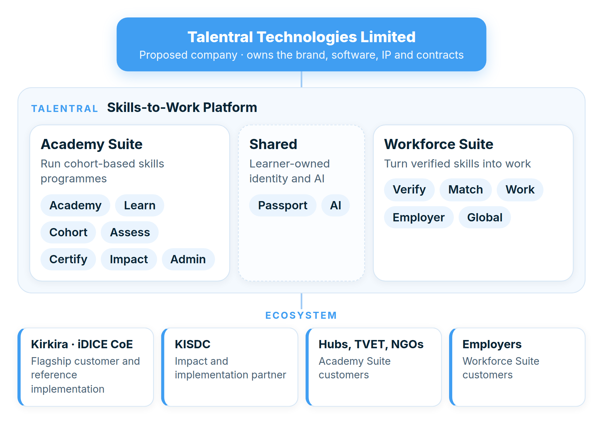
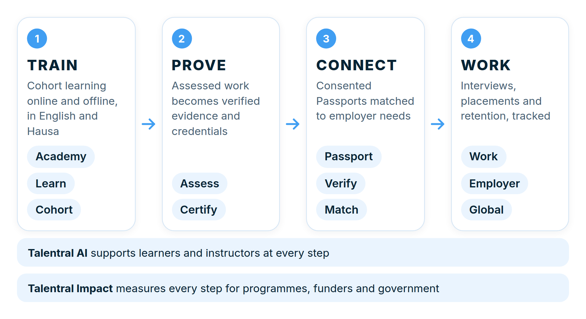
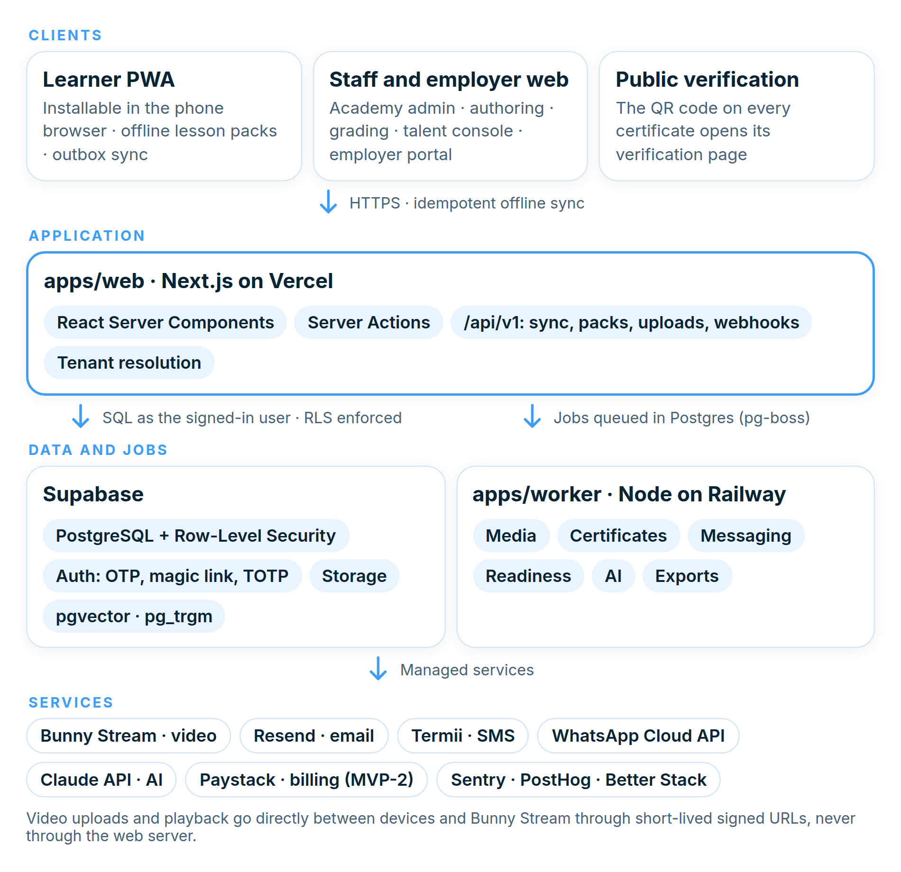
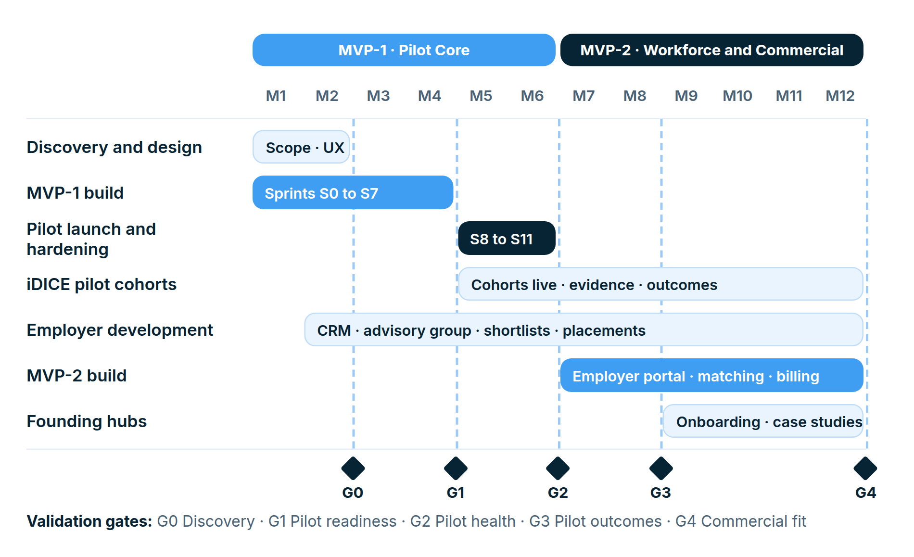

# Talentral: Master Plan and MVP Technical Implementation Guide

**Skills-to-Work Platform.** A Northern Nigeria-built platform for learning, verified talent and employment: from classroom to verified skills to real work.

**Prepared by:** Talentral Technologies Limited (proposed)  
**Prepared for:** Founders and Board, Kirkira Innovation Hub, KISDC, pilot partners and engineering team  
**Strategic context:** iDICE Centre of Excellence flagship pilot  
**Version:** 3.0: concept consolidated, MVP defined, technical implementation added  
**Date:** September 2026  
**Classification:** Confidential. For internal planning and partner discussion.  

> This Markdown file is generated from `docs/master-plan-source`. Edit the source and run `npm run build` there; do not edit this file by hand.

## Document Control

| Version | Date | Summary of change |
| --- | --- | --- |
| 1.0 | Earlier draft | Initial ecosystem plan with two brands: Koyo (learning SaaS) and a separate workforce brand. |
| 2.0 | September 2026 | Adopted a single master brand and one proposed commercial entity. The transition was only partly applied in the text. |
| 3.0 | September 2026 | Working name changed to Talentral after a CAC conflict with the previous name. Brand transition completed throughout. Concept sharpened (beachhead, North Star definition, readiness rules, governance). MVP defined (Part B). Technical implementation guide added (Part C). Figures and a 90-day plan added. |

### How to use this document

| Reader | Read first |
| --- | --- |
| Board, investors, partners | Executive Summary, Part A, Part D |
| Kirkira / iDICE programme team | Executive Summary, A11, Part B (B2, B5, B8) |
| Product and design | Part B in full, C21 |
| Engineering | Part B (B3, B6, B7), Part C in full |
| Legal and compliance | A1.4, A1.5, A10, C12, C18 |

### What changed from Version 2.0

- **New working name: Talentral.** The previous name is registered with CAC by another party, so the platform and the proposed company (Talentral Technologies Limited) now use Talentral, subject to CAC and trademark clearance (A1.5).
- Removed every remaining use of "Koyo" as a product or company. The Academy Suite and Workforce Suite replace the old two-brand split; Koyo is at most an internal codename.
- Unified module names (Talentral Global now covers international mobility; Talentral Employer and Talentral Verify added to the registry).
- Moved the corporate and IP structure next to the brand decision and replaced the text diagrams with figures and tables.
- Replaced the "Kirkira Steering Committee" with governance that fits a company-owned platform: Board, Pilot Steering Committee, Product Council, Talent Governance Panel.
- Defined the North Star metric precisely, published readiness rules and added a beachhead customer profile.
- Resolved open technical choices (backend, queue, video, offline, AI) and recorded them as architecture decisions.
- Split delivery into MVP-1 "Pilot Core" (months 1 to 6) and MVP-2 "Workforce and Commercial" (months 7 to 12) with validation gates.
- Aligned financing language with non-interest principles and ethical recruitment with the employer-pays principle.

## Contents

- [Document Control](#document-control)
- [Executive Summary](#executive-summary)
- **[Part A: Strategic Concept](#part-a-strategic-concept)**
  - [A1. Corporate, Brand and Product Architecture](#a1-corporate-brand-and-product-architecture)
  - [A2. Vision, Mission and Strategic Ambition](#a2-vision-mission-and-strategic-ambition)
  - [A3. Problem Statement](#a3-problem-statement)
  - [A4. Value Proposition by Customer](#a4-value-proposition-by-customer)
  - [A5. Ideal Customer Profiles and Beachhead](#a5-ideal-customer-profiles-and-beachhead)
  - [A6. Product Concept](#a6-product-concept)
  - [A7. Skills Evidence and Employment Readiness](#a7-skills-evidence-and-employment-readiness)
  - [A8. Talentral Passport](#a8-talentral-passport)
  - [A9. Workforce Suite](#a9-workforce-suite)
  - [A10. GCC and International Strategy](#a10-gcc-and-international-strategy)
  - [A11. iDICE Centre of Excellence as Flagship Pilot](#a11-idice-centre-of-excellence-as-flagship-pilot)
  - [A12. Multi-Hub SaaS Strategy](#a12-multi-hub-saas-strategy)
  - [A13. Business Model and Pricing](#a13-business-model-and-pricing)
  - [A14. Go-to-Market](#a14-go-to-market)
  - [A15. Competitive Positioning](#a15-competitive-positioning)
  - [A16. Partnerships](#a16-partnerships)
  - [A17. Operating Model and Governance](#a17-operating-model-and-governance)
  - [A18. Impact Framework](#a18-impact-framework)
  - [A19. Risks and Mitigation](#a19-risks-and-mitigation)
  - [A20. Investment and Funding Proposition](#a20-investment-and-funding-proposition)
  - [A21. Success Definition](#a21-success-definition)
- **[Part B: MVP Definition](#part-b-mvp-definition)**
  - [B1. MVP Principles](#b1-mvp-principles)
  - [B2. Release Phasing](#b2-release-phasing)
  - [B3. Scope Matrix](#b3-scope-matrix)
  - [B4. Roles](#b4-roles)
  - [B5. Core Journeys](#b5-core-journeys)
  - [B6. Epics, User Stories and Acceptance Criteria (MVP-1)](#b6-epics-user-stories-and-acceptance-criteria-mvp-1)
  - [B7. Non-Functional Requirements](#b7-non-functional-requirements)
  - [B8. Validation Gates](#b8-validation-gates)
  - [B9. Explicitly Out of Scope for MVP](#b9-explicitly-out-of-scope-for-mvp)
- **[Part C: Technical Implementation](#part-c-technical-implementation)**
  - [C1. Architecture Decisions](#c1-architecture-decisions)
  - [C2. System Architecture](#c2-system-architecture)
  - [C3. Repository Structure](#c3-repository-structure)
  - [C4. Multi-Tenancy](#c4-multi-tenancy)
  - [C5. Identity, Authentication and Authorisation](#c5-identity-authentication-and-authorisation)
  - [C6. Data Model](#c6-data-model)
  - [C7. Offline and Synchronisation](#c7-offline-and-synchronisation)
  - [C8. Media Pipeline](#c8-media-pipeline)
  - [C9. Assessment, Completion and Evidence Engine](#c9-assessment-completion-and-evidence-engine)
  - [C10. Credentials and Verification](#c10-credentials-and-verification)
  - [C11. Employment Readiness Rules](#c11-employment-readiness-rules)
  - [C12. Passport and Consent Enforcement](#c12-passport-and-consent-enforcement)
  - [C13. Matching Engine (MVP-2)](#c13-matching-engine-mvp-2)
  - [C14. Talentral AI Implementation](#c14-talentral-ai-implementation)
  - [C15. Notifications and Live Sessions](#c15-notifications-and-live-sessions)
  - [C16. Impact Analytics and Reporting](#c16-impact-analytics-and-reporting)
  - [C17. API and Webhooks](#c17-api-and-webhooks)
  - [C18. Security and Data Protection Controls](#c18-security-and-data-protection-controls)
  - [C19. Engineering Workflow, Environments and Testing](#c19-engineering-workflow-environments-and-testing)
  - [C20. Operations and Reliability](#c20-operations-and-reliability)
  - [C21. UI Foundations](#c21-ui-foundations)
  - [C22. Delivery Plan](#c22-delivery-plan)
  - [C23. Team and Budget](#c23-team-and-budget)
  - [C24. Definition of Done](#c24-definition-of-done)
- **[Part D: Action Plan and Recommendation](#part-d-action-plan-and-recommendation)**
  - [D1. The First 90 Days](#d1-the-first-90-days)
  - [D2. First Pilot User Journey](#d2-first-pilot-user-journey)
  - [D3. Strategic Narrative for Partners](#d3-strategic-narrative-for-partners)
  - [D4. Final Strategic Recommendation](#d4-final-strategic-recommendation)
  - [Conclusion](#conclusion)
  - [Appendix A. Product Naming Registry](#appendix-a-product-naming-registry)
  - [Appendix B. Key Assumptions](#appendix-b-key-assumptions)
  - [Appendix C. Glossary](#appendix-c-glossary)

## Executive Summary

Talentral is a Skills-to-Work Platform. It gives training organisations one system to run cohort-based skills programmes, turns each learner's work into verified evidence of skill, and connects that verified talent to employers locally and internationally. Its promise is **TRAIN → PROVE → CONNECT → WORK**.

Talentral is one master brand with two product suites: the **Academy Suite** (academies, learning, cohorts, assessment, credentials, impact reporting) and the **Workforce Suite** (verification, matching, jobs, employer portal, international opportunities). The learner-owned **Talentral Passport** and **Talentral AI** are shared across both. A dedicated company, provisionally **Talentral Technologies Limited**, owns the platform. **Kirkira Innovation Hub** and its **iDICE Centre of Excellence** are the flagship customer and first production environment; **KISDC** is an implementation and impact partner.

The market problem is clear: most skills programmes end at certificates, depend on fragmented tools, struggle with bandwidth, and cannot show funders or employers what graduates can actually do. Talentral differentiates on four points that generic LMS and job platforms do not combine: cohort-first programme management, offline-capable mobile learning in English and Hausa, an evidence-based readiness and Passport model, and a direct bridge to employers.

### Key decisions in this version

| Area | Decision |
| --- | --- |
| Brand and entity | One brand (Talentral, working name pending CAC and trademark clearance), one company (Talentral Technologies Limited). Koyo retired as a public name. |
| Beachhead | Donor-funded digital-skills programmes in Northern Nigeria, starting with the iDICE Centre of Excellence; then founding hubs; employers in remote-compatible sectors. |
| North Star | Verified Opportunity Outcomes: credentialed learners starting paid work within 180 days, confirmed by evidence. |
| MVP-1 (months 1 to 6) | Pilot Core: academy, courses, cohorts, live sessions and attendance, assessment with rubrics, certificates with verification, offline PWA, English and Hausa, Impact dashboard, Passport v1, human-assisted shortlists. |
| MVP-2 (months 7 to 12) | Workforce and Commercial: employer portal, jobs, explainable matching, placements, self-serve hubs, custom domains, billing, AI tutor beta. |
| Technology | TypeScript modular monolith: Next.js PWA, PostgreSQL with Row-Level Security on Supabase, pg-boss worker, Bunny Stream video, Termii and WhatsApp messaging, provider-agnostic AI with Claude as default. |
| Budget | ₦41.5m to ₦83m for the 12-month build (indicative), plus usage-based running costs. |
| Financing | Grants, programme revenue, subscriptions and equity or partnership-based (non-interest) investment. |

### What success looks like at month 12

- iDICE programmes run end to end on Talentral, with completion, readiness and placement data available on demand.
- At least five external tenants onboarded and at least three paying.
- At least 25 employers have received shortlists, and a Verified Opportunity Outcomes baseline exists.
- The platform is ready for public launch with security testing complete.

# Part A: Strategic Concept

Part A sets out what Talentral is, who it serves, how it makes money and how it grows. This version resolves the brand transition started in Version 2.0: Talentral is the single master brand, Talentral Technologies Limited is the proposed commercial entity, and every product capability is a Talentral module. Parts B and C translate this concept into a buildable MVP.

## A1. Corporate, Brand and Product Architecture

### A1.1 Strategic decision

> **Decision adopted in this Master Plan**
>
> Talentral is the **single master commercial brand**, positioned as a **Skills-to-Work Platform**. A dedicated company, provisionally **Talentral Technologies Limited**, owns the software, intellectual property, brand, domains, commercial contracts and platform operations, subject to Nigerian legal, tax, CAC and trademark due diligence.
>
> The earlier two-brand structure (Koyo for learning and a separate brand for workforce) is retired. **Koyo** survives only as an optional internal codename for the platform engine and never appears in customer-facing material unless later brand validation justifies it.

One brand with two product suites gives the market a single, memorable promise from classroom to paycheque. It also concentrates marketing spend, avoids a confusing hand-off between two companies at the most valuable moment in the learner journey (graduation), and keeps one cap table for future investors.

### A1.2 Product suites and modules

Talentral is organised into two suites that share one identity, one data platform and one consent system. A customer can buy the Academy Suite alone. The Workforce Suite draws its strongest supply from the Academy Suite but can also accept verified talent from approved external sources.



*Figure 1. Talentral company, product and ecosystem architecture. Every module carries the Talentral name, for example Talentral Learn.*

| Suite | Module | Purpose |
| --- | --- | --- |
| Academy Suite | Talentral Academy | The white-label academy an organisation runs: storefront, catalogue, branding, custom domain |
|  | Talentral Learn | Learner experience: courses, lessons, media, offline packs, progress |
|  | Talentral Cohort | Cohorts, schedules, live sessions, attendance, announcements, mentors, learning circles |
|  | Talentral Assess | Quizzes, assignments, projects, rubrics and competency evidence |
|  | Talentral Certify | Certificates, badges and a public verification service |
|  | Talentral Impact | Programme analytics, M&E dashboards and funder reporting |
|  | Talentral Admin | Tenant administration, roles, billing and platform controls |
| Shared layer | Talentral AI | Course-grounded tutoring, summaries, question generation, feedback assistance |
|  | Talentral Passport | Learner-owned professional profile built from verified evidence |
| Workforce Suite | Talentral Verify | Identity, credential and skills verification with labelled verification levels |
|  | Talentral Match | Structured matching of verified talent to employer requirements |
|  | Talentral Work | Remote, local, freelance and internship opportunities with placement tracking |
|  | Talentral Employer | Employer portal: jobs, talent search, shortlists, interviews, placements |
|  | Talentral Global | International opportunities, GCC corridor and compliant mobility pathways |

### A1.3 Ecosystem relationships

| Party | Relationship to Talentral Technologies Limited |
| --- | --- |
| Kirkira Innovation Hub / iDICE Centre of Excellence | Flagship customer, reference implementation and ecosystem partner. Operates its academy on Talentral under a pilot agreement. Does not own the commercial platform. |
| KISDC (Kirkira Innovation and Sustainable Development Center) | Development, impact and implementation partner where its mandate and funding allow. The commercial technology does not sit on its balance sheet. |
| Partner hubs, TVET centres, universities, NGOs, academies | Academy Suite customers operating their own branded academies. Optional contributors to the shared talent network. |
| Employers and clients | Demand side. Workforce Suite customers who search, shortlist, engage and place talent. |
| Learners and talent | Users who own their Passport and control what employers see. |
| Donors and government | Programme funders and buyers of outcome reporting. |

### A1.4 Corporate and IP structure

- **Ownership.** Founder(s) and shareholders own Talentral Technologies Limited. The company owns the Talentral brand, source code, platform IP, domains, data-processing agreements and commercial contracts.
- **IP assignment from day one.** Every developer, contractor and agency signs an IP assignment in favour of Talentral Technologies Limited before writing code. Work done before incorporation is assigned by deed on incorporation.
- **Kirkira pilot agreement.** A written agreement covers the iDICE deployment: scope, service levels, fees or in-kind value, data-controller and data-processor roles, case-study rights and exit terms.
- **Separation from other ventures.** Huzex Lab, Disbursify Technologies Limited and other ventures stay outside Talentral's cap table and IP unless a documented investment, licence or related-party agreement says otherwise. Shared services (for example design or engineering support) are invoiced at arm's length.
- **No separate Koyo company.** A spin-out is considered only if market, investment or governance needs later justify it.
- **Investment readiness.** The company is structured so founder equity, an employee share option pool, strategic investors and institutional investors can be added without restructuring the Kirkira ecosystem. Financing follows non-interest principles: equity, Musharakah or Mudarabah partnership structures and grants. No interest-bearing debt.

### A1.5 Brand due diligence before launch

> **Working name: Talentral**
>
> The name used in Version 2.0 was found to be registered with CAC by another party in September 2026. **Talentral** ("talent central": the hub where talent is trained, proven and connected) is the working name from this version, subject to the clearance steps below. The name is set in one place in the document source, so a further change is a one-line edit.
>
> Domain check (September 2026): the .co, .io, .app, .work and .net domains were available; the .com was registered by another party.

Before incorporation or public launch, complete a CAC name availability search and reservation, a Nigerian trademark search and filing (classes 9, 35, 41 and 42 at minimum), domain and social-handle registration, and an international conflict review in the GCC and key African markets. Domain or CAC availability does not establish legal availability of the mark.

## A2. Vision, Mission and Strategic Ambition

### Vision

Digital infrastructure that moves people across Africa from learning to verified skills, and from verified skills to sustainable economic opportunity.

### Mission

Give training organisations and employers the technology, talent intelligence and operational infrastructure to train, assess, credential, match and place skilled people.

### Strategic ambition

- Make the Talentral Academy Suite a leading African platform for running cohort-based skills academies.
- Make the Talentral Workforce Suite a trusted network connecting verified African talent to employers locally and globally.
- Establish Kirkira's iDICE Centre of Excellence as the flagship demonstration and validation environment.
- Build a Northern Nigeria-originated product with Africa-wide and global applicability.
- Shift programme success measurement from training volume toward demonstrated skills, placements and income.

### Core proposition

> **TRAIN → PROVE → CONNECT → WORK.** Talentral for organisations: "Run your entire skills programme from one platform." Talentral for talent and employers: "Turn verified skills into real work."



*Figure 2. The skills-to-work journey and the modules behind each step.*

## A3. Problem Statement

- Many digital-skills programmes end at certificates, not employment outcomes.
- Training organisations stitch together separate tools for registration, learning, attendance, assessment, certificates, community and reporting. Data is lost between them and funder reports are assembled by hand.
- Conventional LMS products target generic education, not cohort-based African skills programmes with mentors, live sessions and practical projects.
- Low bandwidth, data costs and entry-level Android devices make video-first platforms hard to use outside strong urban connectivity.
- Employers cannot distinguish a certificate from demonstrated competence, so they discount local talent or rely on personal networks.
- Training providers lack a systematic pipeline from graduation to employers.
- International employers need trustworthy, structured information on skills, availability, communication ability and work readiness.
- Programme operators need auditable evidence for funders and government.

## A4. Value Proposition by Customer

| Customer | What Talentral gives them | Why they pay or participate |
| --- | --- | --- |
| Learners | One place for lessons, live classes, assignments, projects, credentials and opportunities. Offline learning. English and Hausa. A portable Passport based on evidence. | Free to the learner in funded programmes. Better access to work. |
| Hubs and training organisations | A branded academy without building an LMS. Cohorts, attendance, assessment, certificates and funder reports in one system. Optional route to employers. | Lower operating cost per learner, stronger funder reporting, better graduate outcomes, course revenue. |
| Employers | Searchable, verified talent with evidence alongside CVs. Curated shortlists. Remote and managed-team options. | Faster, lower-risk hiring. Access to talent outside personal networks. |
| Donors and government | Visibility from enrolment to placement. Demographic, geographic and skills analytics. Auditable outcomes. | Proof of impact per naira spent. |

## A5. Ideal Customer Profiles and Beachhead

A focused beachhead matters more than a broad feature list. The MVP serves three buyer types in this order.

| Priority | Customer profile | Buying trigger | Evidence of fit |
| --- | --- | --- | --- |
| 1. Beachhead | Donor-funded digital-skills programmes in Northern Nigeria running 100 to 1,000 learners per cohort (iDICE CoE first) | Funder KPIs on completion and placement; reporting deadlines | Kirkira pilot results; renewal of the programme |
| 2. Expansion | Innovation hubs and ESOs (ecosystem support organisations) in the iDICE network and North-West Nigeria | Need for a professional academy without in-house engineering | Paid subscriptions from founding hubs |
| 3. Demand side | Employers hiring for remote-compatible roles: digital marketing, customer support, virtual assistance, design, software, data | Hard-to-fill entry-level roles; cost pressure | Employer shortlists requested and interviews held |
| Later | Universities, TVET institutions, corporate academies, state agencies, GCC employers | Institutional mandates; workforce programmes | Enterprise contracts |

## A6. Product Concept

### A6.1 The Academy Suite as an academy operating system

Talentral Academy is a multi-tenant SaaS platform. Each organisation (a tenant) receives a logically isolated academy with its own users, courses, cohorts, instructors, branding, certificates, reports and, where subscribed, custom domain. The platform is cohort-first: a course is content, and a cohort is a scheduled group of people moving through that content with instructors, mentors, live sessions and deadlines.

### A6.2 Learner experience

- **Action-first dashboard:** continue learning, next live session, pending assignments, announcements, progress, achievements and career readiness.
- **Formats:** video, audio, text, PDF and resources, quizzes, assignments, projects, live classes, recordings, transcripts and downloadable offline lessons.
- **Microlearning:** units of 5 to 10 minutes combining a short lesson, reading, knowledge check and practical task.
- **Learning paths:** career pathways instead of isolated courses, for example Digital Marketing → Social Media → Content Creation → Analytics → Client Simulation → Capstone.
- **Learning circles:** study groups, peer review, discussions, challenges and mentor interaction inside each cohort.

### A6.3 Localisation and low-bandwidth design

- **Mobile-first:** designed for entry-level Android phones and mobile browsers as an installable Progressive Web App (PWA). Desktop is supported, not primary.
- **Offline-first:** downloadable lesson packs, compressed media, audio-only alternatives, local caching, offline quiz completion where safe, and automatic sync when connectivity returns.
- **Language:** English as the professional language with Hausa as a first-class interface and content language. Arabic and other African languages follow demand.
- **Voice (later):** a Talentral AI voice tutor that answers questions asked in Hausa or English.

### A6.4 Talentral AI principles

AI augments instructors and never replaces human judgement on consequential decisions.

- Answers are grounded in approved course material and cite the source lesson.
- Instructors review AI-generated questions, summaries and feedback before learners see them.
- Grading, certification and employment decisions always keep a human decision-maker.
- The AI layer is provider-agnostic so models can change on cost, quality or data-residency grounds.
- AI usage is metered per tenant so it can be priced and capped.

## A7. Skills Evidence and Employment Readiness

Talentral moves beyond certificate issuance. Each learner accumulates evidence across knowledge tests, practical assignments, projects, attendance, communication tasks and capstones. The evidence feeds a transparent Employment Readiness status.

| Dimension | Evidence | Source module |
| --- | --- | --- |
| Knowledge | Quizzes, examinations, module tests | Assess |
| Practical skill | Rubric-graded assignments and practical tasks | Assess |
| Project capability | Portfolio items and capstone | Assess, Passport |
| Communication | Presentation, written work or structured assessment | Assess |
| Professional behaviour | Attendance, on-time submission, peer and mentor feedback | Cohort |
| Tool proficiency | Practical demonstration graded against a rubric | Assess |
| Interview readiness | Mock interview or structured simulation | Assess |
| Credential status | Verified course or programme completion | Certify |

> **Readiness is a status, not a score**
>
> Talentral shows four plain levels (**Not yet assessed, Developing, Ready, Ready and Verified**) with the evidence behind each dimension. The rules are published to learners and employers. Talentral never presents readiness as a hidden algorithmic score or as a guarantee of employment.

## A8. Talentral Passport

The Passport is the bridge between learning records and work. It belongs to the learner, not to the academy that trained them, so it travels with the learner across tenants and programmes.

#### Profile contents

- Professional identity, location, languages and headline.
- Skills, each linked to the evidence behind it and its verification level.
- Credentials issued on Talentral (auto-attached) and external credentials (self-declared until verified).
- Projects, portfolio links and work samples.
- Experience, availability, work-mode and relocation preferences, target roles.
- Work-authorisation information where relevant (never shown by default).
- Assessment records and references where the learner consents.

#### Control and privacy

- The Passport is private by default. The learner chooses visibility per section: private, shared with specific employers, or discoverable by approved employers.
- Sensitive data (date of birth, NIN, exact address, work authorisation) never appears in employer search results.
- Every share and every employer view is logged and visible to the learner.
- The learner can withdraw consent at any time. Withdrawal removes the profile from search immediately.

## A9. Workforce Suite

| Module | Scope |
| --- | --- |
| Talentral Verify | Identity and credential checks, skills evidence verification. Every claim carries a label: **Self-declared**, **Platform-evidenced** (earned on Talentral), **Verified** (checked by a Talentral officer or trusted issuer). Talentral never implies all information is independently verified. |
| Talentral Match | Matches structured job requirements with verified skills, experience, availability, language, location and work mode. Every match shows its reasons. Matching recommends; employers decide. |
| Talentral Work | Remote jobs, freelance and project engagements, internships and local employment, with application, interview and placement tracking. |
| Talentral Employer | Employer organisation accounts, job posting, talent search, curated shortlists, interview scheduling and placement confirmation. |
| Talentral Global | International opportunities, starting with remote cross-border service delivery. Physical placement only through lawful work-authorisation routes and licensed partners. |
| Managed teams (later) | Talentral-managed delivery teams for clients (digital marketing, customer support, creative production, software, virtual assistance), invoiced as a service. |

## A10. GCC and International Strategy

The GCC corridor (Saudi Arabia, UAE, Qatar) is a strategic market. Talentral enters it through verified employer demand, never through promises to applicants.

1. Start with remote and cross-border service delivery, which needs no migration.
1. Secure employer relationships and signed demand before scaling candidate acquisition.
1. Build occupation-specific talent pools against real job descriptions.
1. Use only lawful recruitment, immigration and employment structures, with licensed local partners where required.
1. Publish transparent contracts, job descriptions and conditions. Candidates never pay recruitment fees: employers pay, in line with the employer-pays principle of ethical recruitment.
1. Maintain safeguarding and anti-exploitation controls, including post-placement check-ins and a grievance channel.

## A11. iDICE Centre of Excellence as Flagship Pilot

The Centre is the Academy Suite's first production environment and the Workforce Suite's first structured talent pipeline.

#### Pilot objectives

- Run selected iDICE programmes end to end on Talentral.
- Create verified learner and skills records for every enrolled learner.
- Produce a portfolio-ready graduate pipeline and first employer engagements.
- Measure conversion from enrolment to completion to opportunity.
- Produce case studies and data for external hub sales.

#### Illustrative pilot targets

| Indicator | Illustrative target |
| --- | --- |
| Learners | 300 to 500 |
| Programmes | 2 to 3 |
| Completion tracking | 100% of enrolled learners |
| Portfolio evidence | At least one capstone or project per applicable track |
| Readiness assessment | All eligible completers |
| Employer engagement | 10 to 25 employers or clients |
| External hubs signed after pilot | 5 to 10 |
| Placement objective | Set after baseline and employer-demand validation |

These figures are planning assumptions, not guaranteed results. Final targets follow confirmation of iDICE programme scope, cohort sizes and contractual KPIs.

## A12. Multi-Hub SaaS Strategy

### A12.1 Founding hub model

Kirkira is the first reference customer. Five to ten selected hubs then join as founding customers on preferential pricing in exchange for structured feedback, product testing and case-study permission.

### A12.2 White-label features

- Logo, brand colours and academy name
- Academy subdomain, then custom domain
- Organisation-specific certificate templates
- Organisation-specific catalogue and communications
- Branded PWA install name and icon (later)

### A12.3 Hub onboarding sequence

1. Organisation registration and verification.
1. Branding and roles configured.
1. Courses imported or created.
1. First cohort created.
1. Administrators and instructors trained (two live sessions plus guides).
1. Learner onboarding launched by invite link, CSV import or public enrolment page.
1. Assessments and certificates configured.
1. Impact dashboard activated.
1. Workforce integration optionally activated.

## A13. Business Model and Pricing

### A13.1 Academy Suite subscriptions

| Tier | Illustrative pricing | Target customer | Included (proposed) |
| --- | --- | --- | --- |
| Community | Free | Individual instructors, small community programmes | Up to 50 active learners, Talentral branding, core learning |
| Hub | ₦50,000 to ₦150,000 per month | Small and medium hubs and academies | Up to 500 active learners, white-label, certificates, Impact dashboard |
| Programme | Custom per cohort | Donor-funded programmes and large cohorts | Priced per enrolled learner, funder reporting pack, implementation support |
| Professional | ₦150,000 to ₦400,000+ per month | Established training organisations | Custom domain, advanced analytics, AI allowance, priority support |
| Enterprise | Custom | Government, universities, large NGOs and corporates | SSO, SLAs, data-residency options, dedicated success manager |

Pricing is indicative and must be validated in customer interviews and pilots. Usage components: active learners above plan, video storage and streaming, AI usage, SMS and WhatsApp messages, premium support. The unit of value is the **active learner per month**, which aligns price with the customer's own programme size.

### A13.2 Workforce Suite revenue

- Employer subscriptions for talent search and shortlists.
- Success fees on placement where legally permissible, charged to employers.
- Managed outsourcing margin on Talentral-managed teams.
- Recruitment and selection services.
- Verification services.
- International mobility services only through compliant, licensed structures.

## A14. Go-to-Market

| Stage | Focus | Exit signal |
| --- | --- | --- |
| 1. Proof through Kirkira | Run iDICE programmes on Talentral and measure outcomes | Pilot completion data and first placements |
| 2. Founding hubs | 5 to 10 hubs in North-West and wider Northern Nigeria | Paid subscriptions and renewals |
| 3. Nigeria | Hubs, TVET providers, NGOs, universities, corporate academies | Repeatable sales cycle under 90 days |
| 4. Africa | African hub networks and skills organisations | First tenants outside Nigeria |
| 5. Global corridors | Employer and talent corridors beyond Nigeria, including the GCC | Recurring cross-border placements |

### Employer acquisition

- Run a structured employer CRM from day one, even before the employer portal exists.
- Start with remote-compatible sectors: digital marketing, customer support, virtual assistance, design, software, data and creative production.
- Form an employer advisory group that reviews curricula and rubrics.
- Offer curated shortlists of three to five candidates instead of raw CV dumps.
- Use talent showcases, demo days and sector talent pools.
- Use pilot placements to build references and case studies.

## A15. Competitive Positioning

| Alternative | Talentral differentiation |
| --- | --- |
| Generic LMS (Moodle, Canvas, Teachable, Thinkific) | Cohort-first, skills-first, offline-capable and linked to employment |
| Course marketplaces (Coursera, Udemy) | Organisation-owned academies with programme management |
| Video meeting tools | The full learning lifecycle, not only live classes |
| Recruitment platforms and job boards | Verified learning evidence and skills provenance |
| Traditional recruitment agencies | A digital talent network fed by a learning pipeline |
| Government programme portals | Reusable infrastructure serving many organisations |
| Generic AI tutors | Course-grounded AI connected to real learner records |

## A16. Partnerships

- iDICE ecosystem and participating ESOs.
- Government digital-skills agencies and state ministries.
- Innovation hub networks, universities and TVET institutions.
- Development partners and NGOs.
- Employer associations and chambers of commerce.
- Cloud, video, AI, payment and messaging providers.
- GCC employers and appropriately licensed recruitment partners.

## A17. Operating Model and Governance

### A17.1 Operating teams

- Product and engineering build and run the platform.
- Customer success onboards and supports tenants.
- Programme implementation supports large deployments such as iDICE.
- Workforce team (talent officers and employer partnerships) develops demand and runs matching.
- Partnerships develops hubs, donors and government relationships.
- M&E produces impact reporting.
- Legal and compliance oversees data protection, recruitment and mobility.

### A17.2 Governance bodies

| Body | Members | Mandate |
| --- | --- | --- |
| Talentral Board | Founder(s), shareholder representatives, independent adviser(s) | Strategy, budget, fundraising, risk |
| Pilot Steering Committee | Talentral product lead, Kirkira/iDICE programme lead, M&E lead, finance/legal representative | Pilot scope, KPIs, escalation, fortnightly review |
| Product Council | Product lead, tech lead, design lead, customer success | Roadmap, change control, release approval, quarterly user feedback |
| Talent Governance Panel | Workforce lead, safeguarding officer, legal adviser | Verification rules, employer access, consent, disputes, suspensions, placement reporting |

## A18. Impact Framework

> **North Star Metric: Verified Opportunity Outcomes**
>
> The number of learners who hold a Talentral credential **and** start a paid engagement (employment, paid internship, freelance or project contract) within 180 days of completion, confirmed by the employer or by documentary evidence.

| Area | Key indicators |
| --- | --- |
| Learning | Enrolment, activation (first lesson within 7 days), weekly active learners, attendance rate, completion rate, assessment completion, project completion, satisfaction, time to completion |
| Talent | Passports created, Passports discoverable, skills assessed, portfolio-ready learners, readiness levels, employer profile views, shortlists, interviews |
| Employment | Applications, matches, offers, placements, 90-day retention, remote engagements, international placements, income generated where ethically and legally measurable |
| SaaS | Paying tenants, MRR, ARR, active learners, net revenue retention, tenant churn, CAC, LTV, support tickets per tenant, uptime |

## A19. Risks and Mitigation

| Risk | Mitigation |
| --- | --- |
| Low willingness to pay | Validate pricing in pilots; programme-based pricing tied to funder budgets; clear cost-per-learner ROI |
| Low learner engagement | Cohort design, WhatsApp and SMS nudges, mentors, microlearning, practical projects |
| Bandwidth and device limits | Offline-first PWA, low-bitrate media, audio and text alternatives, performance budgets enforced in CI |
| AI inaccuracy | Retrieval-grounded AI with citations, instructor review, clear limits, no AI-only grading |
| Slow employer demand | Employer CRM and advisory group from month 1; remote-work sectors first; human-assisted matching before automation |
| International placement harm | Licensed partners only, transparent contracts, no candidate fees, safeguarding officer, grievance channel |
| Data protection breach | Privacy by design, NDPA 2023 compliance, tenant isolation enforced in the database, audits, encryption |
| Scope creep | Strict MVP phasing (Part B), change control through the Product Council |
| Competition from established LMSs | Differentiate on localisation, cohorts, evidence and employment linkage |
| Dependence on one programme | Use iDICE as pilot while building a multi-tenant commercial pipeline from month 6 |
| Key-person dependency | Documented architecture, code review, shared ownership of critical systems |

## A20. Investment and Funding Proposition

Funding separates into three uses: product development, pilot deployment and workforce-market development. All sources follow non-interest principles.

- Grant or programme funding for the iDICE pilot implementation.
- Donor-funded programme deployments on the Programme tier.
- Strategic technology partnerships (cloud credits, AI credits, video credits).
- Employer-funded talent programmes.
- Academy Suite subscriptions and Workforce Suite fees.
- Equity-based impact or venture investment, or Musharakah and Mudarabah partnership financing, after evidence of product-market fit.

The investment narrative rests on measurable outcomes, recurring SaaS revenue, a two-sided network effect (more academies bring more verified talent, which attracts more employers, which makes academies more valuable) and the potential to scale across Africa.

## A21. Success Definition

Talentral succeeds when the Academy Suite is independently valuable to training organisations, the Workforce Suite is independently valuable to employers, and the connection between them creates additional value for both.

- Kirkira runs its major programmes digitally without fragmented tools.
- External hubs pay for the Academy Suite and renew.
- Learners produce verifiable skills evidence and portfolios.
- Employers use Talentral to discover and engage talent, and return.
- Programmes report measurable progression toward employment.
- Remote and physical placement pipelines operate compliantly.
- Revenue is diversified across SaaS and workforce services.
- The platform scales beyond Northern Nigeria without redesigning its core architecture.

# Part B: MVP Definition

Part B defines the smallest credible product that proves the full journey from enrolment to verified skills to a real opportunity. It fixes scope, phases, roles, journeys, user stories, acceptance criteria and the gates that decide when to move to the next phase. Engineering estimates and sprint plans in Part C are built against this scope.

## B1. MVP Principles

1. **Prove the whole journey, thinly.** A narrow version of every step (learn, prove, connect, work) beats a deep version of one step.
1. **Pilot first, product always.** Every feature ships for iDICE but is built multi-tenant, configurable and free of Kirkira-specific code.
1. **Humans before algorithms.** Matching, verification and AI feedback start human-assisted. Automation follows real usage data.
1. **Low bandwidth is a requirement.** Performance and offline behaviour are acceptance criteria, not polish.
1. **Consent is structural.** No learner data reaches an employer without a recorded, revocable consent.
1. **Buy commodity, build differentiation.** Use managed services for auth, video, email, SMS and payments. Build cohorts, evidence, Passport and matching.

> **The design test**
>
> Every MVP feature must contribute to at least one of: **learning**, **evidence**, **opportunity** or **measurable impact**. A feature that serves none of these waits.

## B2. Release Phasing

| Release | Timing | Goal | Headline capabilities |
| --- | --- | --- | --- |
| MVP-1 "Pilot Core" | Months 1 to 6 (first live cohort in month 5) | Run iDICE programmes end to end and create verified evidence | Tenancy, roles, course builder, cohorts, live sessions and attendance, quizzes, assignments and projects with rubrics, certificates with QR verification, offline PWA, English and Hausa UI, notifications, Impact dashboard, Passport v1, talent officer console with human-assisted shortlists |
| MVP-2 "Workforce and Commercial" | Months 7 to 12 | Engage employers directly and sell to founding hubs | Employer portal, jobs, applications, rule-based matching, placements, white-label custom domains, self-serve hub onboarding, Paystack billing, AI tutor, public verification API |
| Post-MVP | Month 13 onward | Scale and deepen | Native Android app, voice tutor, managed teams, GCC mobility operations, ATS integrations, sector taxonomies, Open Badges 3.0 export, advanced analytics warehouse |

## B3. Scope Matrix

**Yes** means included. **Basic** means a first, limited version, described in the epics below. **No** means not included in that release.

| Capability | MVP-1 | MVP-2 | Later |
| --- | --- | --- | --- |
| Multi-tenant platform, tenant isolation | Yes | Yes | Yes |
| Organisation onboarding | Basic: platform-admin assisted | Yes: self-serve | Yes |
| Role-based access control | Yes | Yes | Yes |
| Academy branding (logo, colours, subdomain) | Yes | Yes | Yes |
| Custom domains | No | Yes | Yes |
| Course builder: modules, lessons, text, video, audio, PDF | Yes | Yes | Yes |
| Learning paths | No | Yes | Yes |
| Cohorts, schedules, enrolment, announcements | Yes | Yes | Yes |
| Discussion and learning circles | Basic: cohort discussion threads | Yes: groups, peer review | Yes |
| Live sessions (external meeting link) and attendance | Yes | Yes | Yes |
| In-person attendance by QR check-in | Yes | Yes | Yes |
| Quizzes with auto-grading | Yes | Yes | Yes |
| Assignments and projects with rubric grading | Yes | Yes | Yes |
| Offline PWA: lesson packs, offline quizzes, sync | Yes | Yes | Yes |
| English and Hausa interface | Yes | Yes | Yes |
| Progress tracking | Yes | Yes | Yes |
| Certificates with QR verification page | Yes | Yes | Yes |
| Skills taxonomy (3 to 5 tracks) | Yes | Yes: expanded | Yes: sector taxonomies |
| Employment readiness status | Yes | Yes | Yes |
| Talent Passport with consent controls | Basic: v1 | Yes | Yes |
| Talent officer console and curated shortlists | Yes | Yes | Yes |
| Employer CRM (internal) | Basic: lightweight | Yes | Yes |
| Employer portal, job posting, applications | No | Yes | Yes |
| Rule-based matching with explanations | No | Yes | Yes |
| Placement tracking | Basic: recorded by talent officer | Yes: employer-confirmed | Yes |
| Impact dashboard and CSV/XLSX export | Yes | Yes | Yes: warehouse |
| Notifications: email, SMS, WhatsApp | Yes | Yes | Yes |
| Talentral AI: question generation and summaries for instructors | Yes | Yes | Yes |
| Talentral AI: learner tutor (course-grounded) | No | Yes: beta | Yes |
| Voice tutor | No | No | Yes |
| Subscription billing (Paystack) | No | Yes | Yes |
| Public verification API and webhooks | No | Yes | Yes |
| Audit logs | Yes | Yes | Yes |
| Consent management | Yes | Yes | Yes |
| Native mobile apps | No | No | Yes |
| Managed teams, GCC mobility operations | No | No | Yes |

## B4. Roles

Roles are scoped either to the platform, to a tenant, or to an employer organisation. One person can hold different roles in different tenants (for example, instructor in one academy and learner in another).

| Role | Scope | Core permissions | Release |
| --- | --- | --- | --- |
| Platform Super Admin | Platform | Create and suspend tenants, platform settings, support access (time-limited, audited) | MVP-1 |
| Tenant Owner | Tenant | Everything in the tenant, including billing and role assignment | MVP-1 |
| Tenant Admin | Tenant | Users, branding, courses, cohorts, reports; no billing | MVP-1 |
| Programme Manager | Tenant | Cohorts, enrolments, schedules, announcements, Impact dashboard, exports | MVP-1 |
| Instructor | Tenant, per course or cohort | Author content, run live sessions, grade, issue feedback | MVP-1 |
| Mentor | Tenant, per cohort | View assigned learners' progress, comment, attendance | MVP-1 |
| Assessor | Tenant, per assessment | Grade submissions against rubrics, moderate grades | MVP-1 |
| M&E Officer | Tenant | Read-only analytics and exports | MVP-1 |
| Learner | Tenant (enrolment) and personal (Passport) | Learn, submit, view own records, manage Passport and consent | MVP-1 |
| Talent Officer | Platform (Workforce) | View consented Passports, build shortlists, manage employer CRM, record placements | MVP-1 |
| Employer Admin | Employer organisation | Manage employer profile and team, post jobs, view shortlists | MVP-2 |
| Recruiter | Employer organisation | Search discoverable talent, shortlist, schedule interviews, confirm placements | MVP-2 |
| Billing Admin | Tenant | Plans, invoices, payment methods | MVP-2 |

## B5. Core Journeys

### B5.1 Learner (MVP-1)

1. Receives an invite link by SMS, WhatsApp or email, or enrols through the academy's public programme page.
1. Signs up with phone number (OTP) or email magic link; chooses English or Hausa; completes a short profile (name, gender, age band, LGA and state, education level, device type).
1. Lands on the dashboard showing the next lesson, next live session and pending tasks.
1. Downloads the week's lesson pack on Wi-Fi at the Centre; studies offline at home; offline quiz answers sync on reconnection.
1. Joins live sessions from the dashboard (attendance recorded) or checks in by QR at in-person sessions.
1. Submits assignments and the capstone (file, link or text); receives rubric feedback.
1. Completes the course; receives a certificate with QR verification; readiness status updates.
1. Is invited to publish a Passport; reviews auto-filled skills and evidence; sets visibility; gives consent to be shortlisted.
1. Is notified when shortlisted; confirms interest; attends interview; outcome recorded.

### B5.2 Instructor

1. Creates a course: modules, lessons (text, video upload, audio, PDF), quizzes and assignments with rubrics.
1. Optionally uses Talentral AI to draft quiz questions and lesson summaries, then edits and approves them.
1. Links assessments to skills in the track taxonomy.
1. Schedules live sessions for a cohort and marks or confirms attendance.
1. Grades submissions in a queue with rubric, comment and resubmission option.

### B5.3 Programme Manager

1. Creates a cohort from a course, sets dates, assigns instructors and mentors.
1. Imports learners from CSV or shares an invite link; monitors activation.
1. Sends announcements and automated nudges to inactive learners.
1. Monitors the Impact dashboard: enrolment, attendance, progress, completion, disaggregated by gender, age band and LGA.
1. Exports the funder report (XLSX and PDF) at any date.

### B5.4 Talent Officer (MVP-1, human-assisted matching)

1. Records an employer and a role requirement in the employer CRM.
1. Filters consented Passports by skills, readiness level, location, languages and availability.
1. Builds a shortlist of three to five candidates with notes; candidates confirm interest before the shortlist is shared.
1. Shares the shortlist with the employer through a secure, expiring link showing only consented fields.
1. Records interviews, offers and placements; the outcome flows to the Impact dashboard.

### B5.5 Employer (MVP-2)

1. Registers the organisation; Talentral verifies it before search access is granted.
1. Posts a job with required skills, work mode, location and compensation range.
1. Reviews ranked matches with reasons and invites candidates to apply or interview.
1. Confirms hire and start date; completes a 90-day retention check.

## B6. Epics, User Stories and Acceptance Criteria (MVP-1)

Story IDs are stable references for the backlog. Acceptance criteria are written to be testable by QA and automated where possible.

#### E1. Tenancy and academy setup

| ID | User story | Acceptance criteria |
| --- | --- | --- |
| E1.1 | As a platform admin, I create a tenant with name, slug, logo, colours and default language. | Tenant reachable at `<slug>.<platform-domain>` within 1 minute. Logo and colours applied to learner and admin UI. Slug unique and validated. |
| E1.2 | As a tenant owner, I invite admins and instructors by email or phone. | Invite expires after 7 days. Accepting assigns the role in that tenant only. Invite actions appear in the audit log. |
| E1.3 | As a tenant admin, I can never see another tenant's data. | Automated RLS test suite proves cross-tenant reads and writes fail for every tenant-scoped table. Test runs in CI on every change. |

#### E2. Identity and access

| ID | User story | Acceptance criteria |
| --- | --- | --- |
| E2.1 | As a learner, I sign up with my phone number and a one-time code. | OTP delivered by SMS within 30 seconds on Nigerian networks; WhatsApp OTP fallback. Rate-limited to 5 requests per hour per number. |
| E2.2 | As a staff user, I sign in by email magic link. | Link valid for 15 minutes, single use. |
| E2.3 | As an admin, I must use a second factor. | Tenant Owner, Tenant Admin, Talent Officer and Super Admin roles require TOTP. Enforced server-side. |
| E2.4 | As a user in two academies, I switch between them. | Academy switcher lists only tenants where the user has a membership. Session context changes without re-login. |

#### E3. Course authoring

| ID | User story | Acceptance criteria |
| --- | --- | --- |
| E3.1 | As an instructor, I build a course from modules and lessons. | Drag-and-drop ordering. Lesson types: text (rich text), video, audio, PDF, quiz, assignment. Draft and published states. Autosave every 10 seconds. |
| E3.2 | As an instructor, I upload a video once and learners get versions suited to their connection. | Upload up to 2 GB resumable. Platform produces 240p, 360p and 720p renditions plus an audio-only track. Status visible during processing. |
| E3.3 | As an instructor, I provide lesson content in English and Hausa. | Each lesson can hold a Hausa variant. Learner sees their chosen language with fallback to English and a visible label. |
| E3.4 | As an instructor, I ask Talentral AI to draft questions from a lesson. | Drafts cite the source lesson section. Nothing reaches learners until an instructor approves each item. |

#### E4. Cohorts and enrolment

| ID | User story | Acceptance criteria |
| --- | --- | --- |
| E4.1 | As a programme manager, I create a cohort with start and end dates, instructors and mentors. | Cohort inherits course content; lessons can unlock by date or by completion. |
| E4.2 | As a programme manager, I import learners by CSV. | Template download; row-level validation report; duplicates matched by phone or email; invites sent in batch; 1,000 rows processed in under 2 minutes. |
| E4.3 | As a programme manager, I send announcements. | In-app plus chosen channel (email, SMS, WhatsApp). Delivery status per learner. |
| E4.4 | As a learner, I discuss lessons with my cohort. | Threaded discussion per cohort and per lesson. Report-abuse action. Moderators can hide posts. |

#### E5. Learning experience and offline

| ID | User story | Acceptance criteria |
| --- | --- | --- |
| E5.1 | As a learner, I see what to do next. | Dashboard shows continue-learning, next live session, due tasks and progress. First meaningful paint under 2.5 seconds on a mid-range Android over 3G. |
| E5.2 | As a learner, I download a module to study offline. | Download shows size before start. Lessons, PDFs, images and the chosen video rendition are stored on the device. Works in airplane mode after download. |
| E5.3 | As a learner, I take a practice quiz offline. | Answers stored locally and queued. On reconnection they sync exactly once (idempotent). Server re-grades; the server result wins. |
| E5.4 | As a learner, my progress follows me across devices. | Progress sync resolves conflicts by keeping the furthest progress and the latest completion time. |

#### E6. Live sessions and attendance

| ID | User story | Acceptance criteria |
| --- | --- | --- |
| E6.1 | As an instructor, I schedule a live session with a meeting link. | Supports Google Meet, Zoom, Jitsi or any URL. Learners get reminders 24 hours and 30 minutes before. |
| E6.2 | As a learner, my attendance is captured when I join. | Join-click recorded with timestamp. Instructor confirms or amends the list within 48 hours; confirmed list is final. |
| E6.3 | As a programme manager, in-person attendance is taken by QR. | Session QR rotates every 60 seconds to prevent sharing. Learner scans in-app; check-ins work offline and sync later with the original timestamp. |

#### E7. Assessment and evidence

| ID | User story | Acceptance criteria |
| --- | --- | --- |
| E7.1 | As an instructor, I create quizzes. | Question types: single choice, multiple choice, true/false, short answer (manual marking). Question banks and randomisation. Pass mark and attempt limits. |
| E7.2 | As an instructor, I create assignments and projects with rubrics. | Rubric of criteria and levels with points. Each criterion maps to one or more skills. Submission types: file (max 50 MB), link, text. |
| E7.3 | As an assessor, I grade from a queue. | Queue filters by cohort and status. Rubric scoring, comments, request resubmission. Grade release can be delayed to a set date. |
| E7.4 | As a moderator, I review a sample of grades. | Programme manager can assign a second assessor to a percentage of submissions; disagreements are flagged. |

#### E8. Credentials and verification

| ID | User story | Acceptance criteria |
| --- | --- | --- |
| E8.1 | As a learner, I receive a certificate automatically when I meet completion rules. | Completion rules configurable per course (lessons, pass marks, attendance percentage, capstone). Certificate PDF with tenant branding and QR code. |
| E8.2 | As anyone, I verify a certificate. | QR opens a public page at `/verify/<code>` showing holder name, credential, issuer, date and status (valid, revoked). Page loads without login. |
| E8.3 | As a tenant admin, I revoke a certificate issued in error. | Revocation requires a reason, appears on the verification page and in the audit log. |

#### E9. Skills, readiness and Passport v1

| ID | User story | Acceptance criteria |
| --- | --- | --- |
| E9.1 | As a programme manager, I use a skills taxonomy for my track. | Platform ships starter taxonomies for 3 to 5 tracks. Tenants can add tenant-level skills mapped to platform skills. |
| E9.2 | As a learner, I see my readiness per dimension with the evidence behind it. | Status computed from published rules (see Part C). Each dimension links to the evidence items that satisfy it. |
| E9.3 | As a learner, I publish my Passport. | Auto-filled from credentials and graded evidence. Learner edits headline, bio, preferences and portfolio links. Visibility per section. |
| E9.4 | As a learner, I control consent. | Separate consents: discoverable by talent officers, shareable with named employers, included in anonymised programme research. Each consent timestamped and revocable in one tap. |

#### E10. Talent officer console and shortlists

| ID | User story | Acceptance criteria |
| --- | --- | --- |
| E10.1 | As a talent officer, I log employers and roles. | Employer record with contacts, sector, notes, stage. Role record with skills, work mode, location, pay range. |
| E10.2 | As a talent officer, I search consented talent. | Only Passports with active discoverability consent appear. Filters: skills, readiness, location, language, availability, cohort. |
| E10.3 | As a talent officer, I share a shortlist with an employer. | Candidates confirm interest first. Link expires after 14 days, shows consented fields only, logs each view, and can be revoked. |
| E10.4 | As a talent officer, I record outcomes. | Stages: shortlisted, interviewed, offered, placed, declined. Placement captures employer, role, type, start date and pay band. |

#### E11. Impact and reporting

| ID | User story | Acceptance criteria |
| --- | --- | --- |
| E11.1 | As a programme manager, I monitor the cohort. | Dashboard: enrolled, activated, active this week, attendance rate, progress distribution, completion, readiness, placements. Disaggregation by gender, age band, LGA, disability status where collected. |
| E11.2 | As an M&E officer, I export data. | XLSX and CSV exports of learners, attendance, grades, completion and outcomes. Exports are logged. Personal fields can be excluded for anonymised exports. |
| E11.3 | As a funder, I receive a report. | One-click PDF report per cohort with headline indicators and charts, branded for the tenant. |

#### E12. Notifications

| ID | User story | Acceptance criteria |
| --- | --- | --- |
| E12.1 | As a learner, I get reminders on the channel I use. | Channel preference per user. Templates in English and Hausa. Quiet hours 21:00 to 07:00 WAT for non-urgent messages. |
| E12.2 | As a programme manager, inactive learners are nudged automatically. | Configurable rule, for example no activity for 5 days triggers a WhatsApp nudge; second nudge alerts the mentor. |

#### E13. Platform administration, privacy and audit

| ID | User story | Acceptance criteria |
| --- | --- | --- |
| E13.1 | As a super admin, I support a tenant without permanent access. | Support access requested with a reason, expires after 4 hours, visible to the tenant owner, fully audited. |
| E13.2 | As a learner, I download or delete my data. | Data export in JSON and PDF within 72 hours. Deletion request processed within 30 days, retaining only records the law or funder contracts require, with the learner told what is kept. |
| E13.3 | As a compliance officer, I review who did what. | Append-only audit log of sign-ins, role changes, exports, consent changes, shares, grade changes, revocations and support access. Filterable and exportable. |

## B7. Non-Functional Requirements

| Area | Requirement |
| --- | --- |
| Performance | Learner pages: Largest Contentful Paint under 2.5 s at p75 on a Tecno/Infinix-class Android over a 3G profile. Initial JavaScript under 200 KB compressed. API p95 under 400 ms for reads. |
| Data economy | Default video rendition 360p (about 5 MB per minute or less); 240p option; audio-only option. Images served as WebP/AVIF at responsive sizes. |
| Offline | All downloaded lessons usable in airplane mode. Offline writes (progress, quiz answers, attendance check-ins) sync exactly once. |
| Availability | 99.5% monthly for the learner and admin applications during MVP-1; 99.9% target from MVP-2. |
| Scale | MVP-1 sized for 5,000 registered learners and 1,000 concurrent users; architecture able to reach 100,000 learners without redesign. |
| Security | OWASP ASVS Level 2 controls. TLS 1.2+ everywhere. Encryption at rest. MFA for privileged roles. Tenant isolation enforced in the database. |
| Privacy | Nigeria Data Protection Act 2023 compliance: lawful basis recorded, consent where required, data minimisation, data-subject rights, breach notification within 72 hours. |
| Accessibility | WCAG 2.2 AA. Minimum touch target 44 px. Works with screen readers and at 200% text size. |
| Localisation | All interface strings externalised; English and Hausa complete at MVP-1 launch; right-to-left ready for later Arabic. |
| Browser support | Chrome for Android (last 3 versions), Samsung Internet, Opera Mini in basic mode (read-only), desktop Chrome, Edge, Firefox, Safari. |
| Recoverability | Point-in-time database recovery for 7 days; daily backups kept 30 days; RPO 15 minutes, RTO 4 hours. |

## B8. Validation Gates

Each gate is reviewed by the Pilot Steering Committee. Failing a gate triggers a fix-or-pivot decision, not an automatic stop.

| Gate | When | Pass criteria |
| --- | --- | --- |
| G0 Discovery | End of month 2 | 15 to 25 discovery interviews completed; iDICE KPIs confirmed in writing; MVP-1 scope signed off; 3 employer advisers recruited |
| G1 Pilot readiness | End of month 4 | All MVP-1 epics pass acceptance; security review done; DPIA completed; 20 trial users finish a test module on low-end devices |
| G2 Pilot health | Month 6 | Activation ≥ 70% within 7 days; weekly active ≥ 60%; attendance ≥ 70%; zero cross-tenant incidents; NPS ≥ 30 from learners and staff |
| G3 Pilot outcomes | Month 8 | Completion ≥ 60%; ≥ 80% of completers with readiness assessed; ≥ 10 employers engaged; first placements recorded |
| G4 Commercial fit | Month 12 | ≥ 5 external tenants onboarded, ≥ 3 paying; ≥ 25 employers with at least one shortlist; Verified Opportunity Outcomes baseline established |

## B9. Explicitly Out of Scope for MVP

- Native iOS or Android apps (the PWA covers MVP needs).
- Built-in video conferencing (external meeting links are used).
- Voice tutor and speech interfaces.
- Proctoring and high-stakes remote examinations.
- Course marketplace across tenants and learner-paid course sales (MVP-2 considers paid enrolment for tenants that need it).
- Payroll, contracts management or employer-of-record services.
- GCC physical placement operations and visa processing.
- SCORM and xAPI import (considered post-MVP on customer demand).

# Part C: Technical Implementation

Part C is the engineering blueprint for Parts A and B. It records the architecture decisions, system components, repository layout, tenancy and security model, data model, offline design, the rules behind credentials, readiness and matching, the API surface, delivery pipeline and a sprint-level plan. It is written so a technical lead can start Sprint 0 from this document alone.

## C1. Architecture Decisions

Version 2.0 left the backend open ("NestJS or Laravel"). This version decides. The guiding constraints are a small team, a six-month pilot deadline, strict tenant isolation, low-bandwidth users and a clean path to self-hosting if data-residency rules or cost require it.

| # | Decision | Choice | Rationale |
| --- | --- | --- | --- |
| ADR-01 | Architecture style | Modular monolith in a TypeScript monorepo, plus one background worker | One deployable is fastest for a small team; module boundaries (Academy, Assess, Certify, Passport, Workforce) allow later extraction |
| ADR-02 | Language | TypeScript (strict) end to end | One language across web, API, worker and shared domain logic; shared types and validation |
| ADR-03 | Web framework | Next.js (App Router) with React Server Components | Server rendering keeps client JavaScript small on low-end phones; one codebase for learner, staff and employer UIs |
| ADR-04 | Database | PostgreSQL (15 or later) with Row-Level Security, pgvector, pg_trgm | Tenant isolation enforced by the database, not only by application code; vectors and fuzzy search without extra services |
| ADR-05 | Managed backend | Supabase (Postgres, Auth, Storage) for MVP | Phone OTP, magic links, storage and RLS out of the box; standard Postgres means no lock-in and a self-host path |
| ADR-06 | ORM and migrations | Drizzle ORM with SQL migrations in Git; RLS policies written as SQL | Type-safe queries, readable SQL, reviewable policies |
| ADR-07 | Background jobs | pg-boss (Postgres-backed queue) in a Node worker | No extra Redis to operate in MVP; transactional enqueue with business writes |
| ADR-08 | Video | Bunny Stream (primary), Mux (fallback) after a two-week cost and latency spike from Katsina, Kano and Abuja | Low cost per GB, multiple renditions, MP4 downloads for offline |
| ADR-09 | Offline | PWA: Serwist service worker, IndexedDB via Dexie, outbox sync with idempotent operations | Works on the devices learners already own; no app-store dependency |
| ADR-10 | Internationalisation | next-intl with ICU messages; locale fields on content | Hausa as first-class; plural and gender rules handled properly |
| ADR-11 | UI | Tailwind CSS and shadcn/ui on Huzex Light tokens | Fast, consistent, accessible components |
| ADR-12 | Messaging | Resend (email), Termii (SMS, via Supabase Send-SMS hook), WhatsApp Cloud API (Meta) | Reliable Nigerian SMS delivery; WhatsApp is where learners are |
| ADR-13 | AI | Provider-agnostic gateway; Anthropic Claude as default model provider; pgvector for retrieval | Swap providers without touching features; per-tenant metering |
| ADR-14 | Hosting | Vercel (web), Supabase (data), Railway (worker), Bunny (media) | Managed, low-ops, preview environments per pull request |
| ADR-15 | Payments (MVP-2) | Paystack subscriptions and invoices; bank transfer reconciliation | Naira-native, widely used by Nigerian organisations |
| ADR-16 | Observability | Sentry (errors, performance), PostHog (product analytics), Better Stack (uptime, logs) | Visibility from day one at low cost |

## C2. System Architecture

The platform has five runtime parts. Every request that touches tenant data passes through Postgres RLS, whichever part it comes from.



*Figure 3. System architecture: clients, application, data and jobs, and managed services.*

## C3. Repository Structure

```text
talentral/
├─ apps/
│  ├─ web/                    Next.js app: learner, staff, workforce, public verify
│  │  ├─ app/(learner)/       dashboard, course player, downloads, passport
│  │  ├─ app/(academy)/       admin, authoring, cohorts, grading, impact
│  │  ├─ app/(workforce)/     talent officer console, employer portal (MVP-2)
│  │  ├─ app/(platform)/      super admin
│  │  ├─ app/verify/[code]/   public credential verification
│  │  ├─ app/api/v1/          sync, uploads, webhooks, public API
│  │  ├─ middleware.ts        host → tenant resolution, locale
│  │  └─ sw.ts                service worker (Serwist)
│  └─ worker/                 pg-boss consumers and scheduled jobs
├─ packages/
│  ├─ db/                     Drizzle schema, migrations, RLS policies, pgTAP tests
│  ├─ domain/                 pure logic: completion, grading, readiness, matching
│  ├─ offline/                outbox, sync client, content-pack manager
│  ├─ ai/                     provider gateway, prompts, retrieval, metering
│  ├─ messaging/              email, SMS, WhatsApp adapters and templates
│  ├─ ui/                     design system on Huzex Light tokens
│  ├─ i18n/                   en and ha message catalogues
│  └─ config/                 eslint, tsconfig, tailwind presets
├─ docs/adr/                  architecture decision records
└─ .github/workflows/         CI: typecheck, lint, unit, RLS, e2e, Lighthouse
```

Rule: `packages/domain` has no I/O and no framework imports. The same functions compute completion and readiness on the server and preview them on the device, so the number a learner sees and the number a report shows come from one function.

## C4. Multi-Tenancy

### C4.1 Tenant resolution

- Each tenant has a slug and optional custom domain. Middleware maps the request host to a tenant ID (cached at the edge for 5 minutes) and passes it to server code.
- Platform-level surfaces (Passport, talent officer console, verification) live on the platform domain and are not tenant-scoped.
- A user may hold memberships in several tenants. The active tenant is the one resolved from the host; server code checks the user holds a membership there.

### C4.2 Isolation in the database

Every tenant-scoped table carries a non-null `tenant_id`. RLS is enabled on every such table, and policies check membership and role through security-definer helper functions. Application code runs queries as the signed-in user so RLS applies. The service role, which bypasses RLS, is only available to the worker for system jobs and never to request-handling code.

```sql
-- schema app holds security-definer helpers; grant usage on it to authenticated
-- helper: does the current user hold one of these roles in this tenant?
create function app.has_role(t uuid, roles text[]) returns boolean
language sql stable security definer set search_path = '' as $$
  select exists (
    select 1 from public.memberships m
    where m.tenant_id = t and m.user_id = auth.uid()
      and m.status = 'active' and m.role = any(roles)
  );
$$;

alter table public.courses enable row level security;

create policy courses_read on public.courses for select
  using (app.has_role(tenant_id, array['owner','admin','programme_manager',
                                       'instructor','mentor','assessor','me_officer'])
         or (status = 'published' and app.is_enrolled_in_course(id)));

create policy courses_write on public.courses for all
  using (app.has_role(tenant_id, array['owner','admin','instructor']))
  with check (app.has_role(tenant_id, array['owner','admin','instructor']));
```

```ts
// packages/db: every request-scoped query runs inside withUser()
export async function withUser<T>(claims: JwtClaims, fn: (tx: Tx) => Promise<T>) {
  return db.transaction(async (tx) => {
    await tx.execute(sql`set local role authenticated`);
    await tx.execute(sql`select set_config('request.jwt.claims', ${JSON.stringify(claims)}, true)`);
    return fn(tx);
  });
}
```

### C4.3 Isolation tests

A generated pgTAP suite creates two tenants with users in every role, then asserts that each role can perform exactly its permitted operations on every table in its own tenant and none in the other. The suite runs in CI on every pull request; a new table without RLS fails the build.

## C5. Identity, Authentication and Authorisation

- **Learners:** phone OTP (Termii SMS, WhatsApp fallback) or email magic link. Sessions last 30 days with refresh, so downloaded content stays usable offline.
- **Staff:** email magic link plus mandatory TOTP for Owner, Admin, Talent Officer and Super Admin.
- **Enterprise (later):** SAML or OIDC single sign-on per tenant.
- **Authorisation:** roles from `memberships` (tenant roles), `employer_members` (employer roles) and `platform_roles` (Super Admin, Talent Officer). Permission checks live in one module (`can(user, action, resource)`) and are mirrored in RLS.
- **Support access:** Super Admin gains a time-boxed membership (4 hours) with a recorded reason; the tenant owner is notified.

#### Permission matrix (MVP-1 excerpt)

**Yes** means full permission. A qualifier (for example **Own** or **Assigned**) means the permission is limited to that scope. Blank means no permission.

| Action | Owner | Admin | Prog. Mgr | Instructor | Mentor | Assessor | M&E | Learner |
| --- | --- | --- | --- | --- | --- | --- | --- | --- |
| Manage branding and roles | Yes | Yes |  |  |  |  |  |  |
| Create and edit courses | Yes | Yes |  | Yes |  |  |  |  |
| Create cohorts, enrol learners | Yes | Yes | Yes |  |  |  |  |  |
| Schedule sessions, take attendance | Yes | Yes | Yes | Yes | Assigned |  |  |  |
| Grade submissions | Yes | Yes |  | Yes |  | Yes |  |  |
| View cohort progress | Yes | Yes | Yes | Yes | Assigned | Assigned | Yes |  |
| Export personal data | Yes | Yes | Yes |  |  |  | Anon. | Own |
| Issue or revoke certificates | Yes | Yes | Issue |  |  |  |  |  |
| Learn and submit work |  |  |  |  |  |  |  | Yes |

## C6. Data Model

All tables use UUIDv7 primary keys (time-ordered, generated client-side for offline writes), `created_at`, `updated_at`, and soft-delete `deleted_at` where records must be retained. Tenant-scoped tables carry `tenant_id`. Key columns only are listed.

#### Identity and tenancy

| Table | Key columns | Notes |
| --- | --- | --- |
| tenants | id, slug, name, custom_domain, branding (jsonb), default_locale, plan, status | One per academy |
| users | id (= auth user), full_name, phone, email, locale, gender, birth_year, state, lga, disability_status | Profile; sensitive fields protected |
| memberships | tenant_id, user_id, role, status, invited_by, expires_at | Unique (tenant_id, user_id, role) |
| platform_roles | user_id, role (super_admin, talent_officer) | Platform-level roles |
| invites | tenant_id, email\|phone, role, token_hash, expires_at, accepted_at | Token stored hashed |

#### Learning and cohorts

| Table | Key columns | Notes |
| --- | --- | --- |
| courses | tenant_id, title, slug, summary, locales, status, track_id, completion_rules (jsonb) | Content container |
| modules | tenant_id, course_id, position, title |  |
| lessons | tenant_id, module_id, position, type, title, body (jsonb per locale), media_id, duration_s, offline_allowed | type: text, video, audio, pdf, quiz, assignment, live |
| media | tenant_id, kind, provider, provider_ref, renditions (jsonb), size_bytes, status | Bunny or Storage objects |
| cohorts | tenant_id, course_id, name, starts_on, ends_on, unlock_mode, status |  |
| cohort_staff | tenant_id, cohort_id, user_id, role (instructor, mentor, assessor) |  |
| enrollments | tenant_id, cohort_id, user_id, status, enrolled_at, completed_at, source | Unique (cohort_id, user_id) |
| lesson_progress | tenant_id, enrollment_id, lesson_id, status, percent, last_position_s, completed_at | Merged by furthest progress |
| live_sessions | tenant_id, cohort_id, title, starts_at, ends_at, meeting_url, mode (online, in_person, hybrid) |  |
| attendance | tenant_id, session_id, user_id, method (join, qr, manual), recorded_at, confirmed_by | Unique (session_id, user_id) |
| announcements, discussion_threads, discussion_posts | tenant_id, cohort_id, author_id, body, hidden_at | Moderation fields |

#### Assessment, skills and credentials

| Table | Key columns | Notes |
| --- | --- | --- |
| skills | id, tenant_id (null = platform), track_id, name (per locale), parent_id, maps_to_skill_id | Platform taxonomy plus tenant extensions |
| tracks | id, name, readiness_rules (jsonb) | Digital Marketing, Software, Design, Customer Support, Data (initial) |
| assessments | tenant_id, lesson_id, kind (quiz, assignment, project, capstone, interview), pass_mark, attempts, stakes (practice, graded) |  |
| questions | tenant_id, assessment_id, type, prompt (per locale), options, answer_key, skill_ids, ai_generated, approved_by | answer_key never sent to clients for graded quizzes |
| rubrics, rubric_criteria, rubric_levels | tenant_id, assessment_id, criterion, skill_ids, dimension, level, points, descriptor | Criteria map to skills and readiness dimensions |
| submissions | tenant_id, assessment_id, user_id, attempt, payload, files, submitted_at, client_op_id | Idempotent on client_op_id |
| grades | tenant_id, submission_id, grader_id, score, criterion_scores, feedback, released_at, moderated_by |  |
| evidence | id, user_id, tenant_id, skill_id, dimension, source_type, source_id, level, verification (self, platform, verified), issued_at | Denormalised evidence ledger used by readiness and Passport |
| credentials | id, tenant_id, user_id, course_id, code, issued_at, revoked_at, revoke_reason, payload (jsonb), signature | Signed Ed25519; code is public |

#### Passport, consent and workforce

| Table | Key columns | Notes |
| --- | --- | --- |
| passports | user_id, headline, bio, target_roles, work_modes, availability_from, relocation, languages, visibility (jsonb per section), readiness (jsonb) | User-owned, not tenant-scoped |
| portfolio_items | user_id, title, url, file_id, skill_ids, evidence_id |  |
| consents | user_id, purpose, audience (talent_officers, employer:<id>, research), granted_at, withdrawn_at, text_version | Immutable rows; latest wins |
| employers | id, name, sector, country, verified_at, status |  |
| employer_members | employer_id, user_id, role | MVP-2 |
| roles_open (jobs) | employer_id, title, skills (jsonb with weights), work_mode, location, pay_min, pay_max, currency, status |  |
| shortlists, shortlist_candidates | employer_id, job_id, created_by, share_token_hash, expires_at; user_id, stage, candidate_confirmed_at |  |
| placements | user_id, employer_id, job_id, type, start_date, pay_band, confirmed_by, retention_90d | Feeds North Star metric |
| profile_views | user_id, viewer_id, viewer_employer_id, context, viewed_at | Visible to learner |

#### Platform

| Table | Key columns | Notes |
| --- | --- | --- |
| audit_log | id, tenant_id, actor_id, action, target_type, target_id, metadata, ip_hash, at | Append-only: update and delete revoked from every role |
| sync_ops | op_id, user_id, kind, applied_at, result | Idempotency ledger for offline writes |
| notifications, message_log | user_id, channel, template, locale, status, provider_ref |  |
| ai_usage | tenant_id, user_id, feature, model, input_tokens, output_tokens, cost_minor | Metering and caps |
| doc_chunks | tenant_id, lesson_id, locale, content, embedding vector | Retrieval for Talentral AI |
| subscriptions, invoices (MVP-2) | tenant_id, plan, status, period_end, paystack_ref, amount_kobo |  |

## C7. Offline and Synchronisation

### C7.1 Content packs

- A module download creates a **pack manifest**: list of lesson JSON, images, PDFs and the chosen media rendition, each with URL, byte size and content hash.
- The app shows total size and checks storage quota (`navigator.storage.estimate`) before downloading, and requests persistent storage.
- Files are stored in Cache Storage; lesson JSON in IndexedDB. Video is the MP4 rendition the learner picks (240p default for downloads).
- Signed media URLs are refreshed at download time; cached copies expire 30 days after download or when the cohort ends.
- Packs update in the background on Wi-Fi only when the manifest hash changes.

### C7.2 Outbox and sync

1. Every offline write (progress, practice quiz answers, graded quiz submissions, QR attendance, discussion drafts) becomes an operation with a client-generated UUIDv7 `op_id`, kind, payload and device timestamp, stored in the IndexedDB outbox.
1. When online, the client posts batches of up to 100 operations to `POST /api/v1/sync/push`. Background Sync triggers this when supported; otherwise on app open and every 60 seconds while open.
1. The server applies each operation in a transaction and records the `op_id` in `sync_ops`. A repeated `op_id` returns the stored result without re-applying, so retries are safe.
1. The client pulls changes with `GET /api/v1/sync/pull?since=<cursor>` (grades released, announcements, schedule changes) and advances its cursor.
1. Conflict rules: progress keeps the maximum; completion keeps the earliest completion time; submissions are append-only attempts; attendance keeps the first valid check-in.

### C7.3 Quiz integrity offline

Practice quizzes ship with their answer keys and give instant feedback offline. Graded quizzes never ship answer keys: answers are queued offline and graded by the server on sync, and the learner sees "Submitted, result after sync". QR attendance tokens embed a session ID and a 60-second time window signed by the server; offline check-ins are accepted only if the device timestamp falls inside the window and the sync arrives within 72 hours.

## C8. Media Pipeline

1. Instructor uploads through a resumable upload (tus) directly to Bunny Stream using a short-lived signed URL; the file never passes through the web server.
1. Bunny produces HLS renditions (240p, 360p, 720p) and MP4 fallbacks; the worker receives the webhook and marks `media.status = ready`.
1. The worker extracts an audio-only AAC track (64 kbps) for audio-mode learning.
1. Transcripts are generated for accessibility and AI retrieval, then reviewed by the instructor.
1. Playback uses token-authenticated URLs that expire after 6 hours; the default rendition adapts to connection, capped at 360p on cellular unless the learner opts up.
1. PDFs and images go to Supabase Storage; images are resized to responsive WebP/AVIF variants.

## C9. Assessment, Completion and Evidence Engine

- **Auto-grading** for choice questions is a pure function in `packages/domain`; short answers go to the grading queue.
- **Rubric grading:** each criterion maps to skills and a readiness dimension. On grade release the worker writes rows to the `evidence` ledger (skill, dimension, level, source).
- **Completion rules** are stored per course as JSON and evaluated by one pure function.

```json
{
  "requireLessonsPercent": 90,
  "requirePassedAssessments": ["all_graded"],
  "minAttendancePercent": 75,
  "requireCapstone": true
}
```

## C10. Credentials and Verification

1. When completion rules are satisfied, the worker creates a credential record with a 10-character public code (Crockford base32, no ambiguous characters).
1. The payload (holder name, course, issuer tenant, issue date, skills) is signed with the platform Ed25519 key held in the secret manager; the signature and key ID are stored.
1. The worker renders the tenant-branded PDF with a QR code pointing to `/verify/<code>` and stores it.
1. The verification page shows status from the database (valid or revoked) and validates the signature, so tampered PDFs are detectable.
1. MVP-2 exposes `GET /api/v1/public/credentials/<code>`; post-MVP adds Open Badges 3.0 / W3C Verifiable Credential export.

## C11. Employment Readiness Rules

Readiness is computed by a pure function from the evidence ledger and the track's published rules. Tracks can tune thresholds; defaults are below.

| Dimension | Met when (default rule) |
| --- | --- |
| Knowledge | All graded module quizzes passed at the pass mark |
| Practical skill | At least 3 rubric-graded practical tasks at "Proficient" level or above |
| Project capability | Capstone graded at 60% or above by an assessor |
| Communication | Communication-mapped rubric criteria at level 3 of 4 or above |
| Professional behaviour | Attendance at 75% or above and at least 80% of submissions on time |
| Tool proficiency | Tool-mapped criteria at "Proficient" or above |
| Interview readiness | Mock interview rubric completed at level 3 of 4 or above |
| Credential status | Valid course or programme credential |

| Status | Rule |
| --- | --- |
| Not yet assessed | No graded evidence yet |
| Developing | Some evidence, fewer than 6 dimensions met, or no credential |
| Ready | Credential held and at least 6 of 8 dimensions met |
| Ready and Verified | Ready, plus capstone moderated by a second assessor or a talent officer verification interview |

Readiness is recomputed by a job whenever new evidence is written. The Passport displays each dimension with links to its evidence. Protected characteristics (gender, age, disability, religion, ethnicity) are never inputs.

## C12. Passport and Consent Enforcement

- Passports are read through a single database view per audience (`passport_for_officer`, `passport_for_employer`) that joins the latest active consent and applies section visibility. Base tables are not directly readable by workforce roles.
- Shortlist links carry a random 32-byte token (stored hashed), expire after 14 days, and render only fields allowed by consent at view time, so withdrawal takes effect immediately.
- Every view writes to `profile_views`, which the learner can see.
- Consent text is versioned; a material change to the text requires re-consent.

## C13. Matching Engine (MVP-2)

#### Stage 1: hard filters

Active discoverability consent, work mode compatible, location compatible for on-site roles, availability date before job start, required languages present.

#### Stage 2: explainable score (0 to 100)

| Component | Weight | Calculation |
| --- | --- | --- |
| Skill coverage | 50% | Sum over required skills of (job skill weight × evidence factor). Job skill weights sum to 1. Evidence factor: 1.0 verified, 0.8 platform-evidenced, 0.3 self-declared, 0 missing |
| Readiness | 20% | Ready and Verified 1.0, Ready 0.8, Developing 0.3 |
| Language fit | 10% | Share of preferred languages held |
| Availability | 10% | 1.0 if available by start date, decaying linearly over 30 days |
| Relevant experience | 10% | Portfolio items and past placements tagged with the job's skills, capped |

Every result lists its top reasons ("Verified: Google Ads, capstone 82%", "Available from 1 March") and its gaps. Talent officers review automated shortlists before employers see them during MVP-2. The team monitors shortlist composition by gender and state each month to catch bias introduced through the data.

## C14. Talentral AI Implementation

| Feature | Release | Implementation |
| --- | --- | --- |
| Question generation | MVP-1 | Lesson text and transcript sent with a structured-output prompt; returns questions with source quotes; all drafts require approval |
| Lesson summaries | MVP-1 | Generated per locale; instructor approves; stored as lesson content |
| Feedback assistance | MVP-2 | Drafts rubric-aligned feedback for the assessor to edit; never sets a grade |
| Course tutor | MVP-2 beta | Retrieval over approved `doc_chunks` for the learner's enrolled courses only; answers cite lessons; refuses when context is insufficient; Hausa and English |
| Reporting assistant | Later | Narrative drafts for funder reports from aggregate metrics |

- **Models:** Anthropic Claude as default provider, using a fast, low-cost model (for example `claude-haiku-4-5`) for summaries and classification and a stronger model (for example `claude-sonnet-5-5`) for question generation and tutoring. Model IDs are configuration, not code.
- **Embeddings:** a multilingual embedding model selected by a retrieval test on Hausa and English course content; stored in pgvector.
- **Guardrails:** tenant-scoped retrieval enforced by RLS; no personal data in prompts beyond first name; prompt and response logging with 30-day retention; per-tenant monthly token caps.
- **Evaluation:** a fixed test set of 100 questions per track, checked before each prompt or model change.

## C15. Notifications and Live Sessions

- **Channels:** in-app, email (Resend), SMS (Termii), WhatsApp (Cloud API with pre-approved templates in English and Hausa).
- **Routing:** user preference first; fallback SMS if WhatsApp fails; quiet hours 21:00 to 07:00 WAT for non-urgent messages.
- **Cost control:** SMS and WhatsApp messages are metered per tenant and shown in the admin panel.
- **Live sessions:** meeting URL stored per session; the join button records attendance then redirects; reminders at 24 hours and 30 minutes; recordings attached as lessons afterwards.

## C16. Impact Analytics and Reporting

- Operational metrics come from SQL views over transactional tables, refreshed as materialised views every 15 minutes by the worker.
- Disaggregation fields (gender, age band, state, LGA, disability status) are collected at onboarding with an explanation of purpose and a "prefer not to say" option.
- Exports are generated by the worker, stored for 7 days behind signed URLs and logged in the audit log.
- Small-cell suppression: aggregates covering fewer than 5 people are hidden in anonymised exports.
- A warehouse (for example BigQuery or ClickHouse) is introduced only when cross-tenant analytics outgrow Postgres.

## C17. API and Webhooks

UI mutations use Server Actions. A versioned REST API under `/api/v1` serves the offline client, integrations and the public. Request and response schemas are defined in Zod and published as OpenAPI.

| Endpoint | Purpose | Release |
| --- | --- | --- |
| POST /api/v1/sync/push | Apply a batch of offline operations idempotently | MVP-1 |
| GET /api/v1/sync/pull?since= | Changes since cursor for the signed-in learner | MVP-1 |
| GET /api/v1/packs/{moduleId} | Content-pack manifest with signed URLs | MVP-1 |
| POST /api/v1/uploads | Signed upload URL for submissions and media | MVP-1 |
| POST /api/v1/attendance/qr | QR check-in (online or synced) | MVP-1 |
| POST /api/v1/webhooks/{provider} | Bunny, Termii, WhatsApp, Paystack callbacks (signature verified) | MVP-1 / MVP-2 |
| GET /api/v1/public/credentials/{code} | Public credential verification | MVP-2 |
| GET/POST /api/v1/tenants/{id}/learners | Import and export learners (API key) | MVP-2 |
| GET /api/v1/employer/matches?job= | Ranked matches with reasons | MVP-2 |

Outbound webhooks (MVP-2): `enrollment.created`, `lesson.completed`, `course.completed`, `credential.issued`, `credential.revoked`, `placement.recorded`. Payloads are signed with HMAC-SHA256, retried with exponential backoff for 24 hours and visible in a delivery log.

## C18. Security and Data Protection Controls

| Control | Implementation |
| --- | --- |
| Tenant isolation | RLS on every tenant table; pgTAP isolation suite in CI; service role restricted to the worker |
| Authentication | OTP rate limits; magic-link expiry; mandatory TOTP for privileged roles; session revocation on role change |
| Least privilege | Role matrix mirrored in RLS; time-boxed support access; production database access by named engineers only, through audited sessions |
| Encryption | TLS 1.2+; encryption at rest for database and storage; sensitive columns (NIN, work authorisation) encrypted with pgsodium or application-level keys |
| Audit | Append-only `audit_log` for sign-ins, role changes, exports, consents, shares, grades, revocations, support access |
| Application security | OWASP ASVS L2; CSP and security headers; Zod validation on every input; dependency scanning (Dependabot) and secret scanning; SAST in CI |
| File safety | Content-type allow-list; 50 MB cap; malware scan on uploads before other users can download them |
| Abuse | Rate limiting per IP and user; report-abuse on discussions; moderation tools |
| NDPA 2023 | Record of processing; lawful basis per purpose; DPIA before pilot; data-subject request workflow; 72-hour breach notification runbook; controller/processor terms with each tenant; cross-border transfer safeguards documented for hosting outside Nigeria |
| Retention | Learning records kept for the funder-required period (default 5 years); inactive Passports archived after 3 years with notice; logs 1 year |
| Safeguarding | Minimum age 16 on Workforce features; employer verification before search access; grievance channel; safeguarding officer |
| Testing | Independent penetration test before MVP-2 public launch |

## C19. Engineering Workflow, Environments and Testing

| Environment | Purpose | Data |
| --- | --- | --- |
| Local | Development with the Supabase CLI (Postgres, Auth, Storage in Docker) | Seed data |
| Preview | One per pull request (Vercel preview plus Supabase branch) | Seed data |
| Staging | Release candidate, UAT, device testing | Anonymised copy |
| Production | Live tenants | Real data |

#### CI pipeline (GitHub Actions) on every pull request

1. Typecheck, lint and format check.
1. Unit tests (Vitest) for `packages/domain` with 90% line coverage required.
1. Migration apply plus pgTAP RLS isolation suite.
1. Playwright end-to-end tests on a mobile profile with network throttling, including an offline scenario.
1. Lighthouse CI against performance budgets (fails on regression beyond budget) and axe accessibility checks.
1. Dependency and secret scanning.

#### Release process

Trunk-based development with short-lived branches, required review, and squash merges. Production deploys from `main` after staging sign-off, behind feature flags (PostHog) for anything learner-facing. Migrations are forward-only and backwards-compatible for one release. Weekly release cadence during the pilot; hotfixes follow the same pipeline.

## C20. Operations and Reliability

- **SLOs:** 99.5% availability (MVP-1), p95 read latency under 400 ms, sync success rate above 99%.
- **Monitoring:** Sentry for errors and performance, Better Stack uptime checks every minute from Europe and Africa, alerts to an on-call WhatsApp group.
- **Backups:** Supabase point-in-time recovery (7 days) plus a nightly logical dump to separate storage kept for 30 days; restore drill every quarter.
- **Incident response:** severity levels, a named incident lead, status updates to tenants, a post-incident review within 5 working days.
- **Pilot support:** a Talentral support desk (WhatsApp and email) with a 4-working-hour first-response target and on-site support at the Centre during launch weeks.

## C21. UI Foundations

| Token | Value | Use |
| --- | --- | --- |
| Primary | #409EF2 | Actions, links, focus rings, progress |
| Ink | #072435 | Headings and primary text |
| Surface | #FFFFFF / #F7FAFD | Pages and cards (light theme only) |
| Primary tints | #EAF4FE, #CFE6FC | Selected states, callouts, badges |
| Radius | 12 to 16 px | Cards, dialogs, inputs |
| Shadow | Soft, low-opacity | Cards and popovers |
| Overlay | White at 70% with backdrop blur | Modals; never dark overlays |

Tenant branding overrides primary colour and logo only; the platform enforces contrast ratios of at least 4.5:1 and falls back to the default primary when a tenant colour fails. Every screen is designed at 360 px width first.

## C22. Delivery Plan



*Figure 4. Twelve-month roadmap with releases, workstreams and validation gates.*

### C22.1 MVP-1 sprint plan (two-week sprints)

| Sprint | Weeks | Deliverables |
| --- | --- | --- |
| S0 | 1 to 2 | Monorepo, CI, environments, Supabase project, design tokens and core components, ADRs, tenancy schema and RLS helpers with isolation tests |
| S1 | 3 to 4 | Auth (phone OTP, magic link, TOTP), tenants, memberships, invites, roles, branding, audit log |
| S2 | 5 to 6 | Course builder (modules, lessons, rich text, PDF), Bunny upload and renditions, lesson player |
| S3 | 7 to 8 | Cohorts, enrolment, CSV import, learner dashboard, English and Hausa interface |
| S4 | 9 to 10 | Notifications (email, SMS, WhatsApp), announcements, live sessions, join and QR attendance |
| S5 | 11 to 12 | Quizzes and auto-grading, assignments and projects, rubrics, grading queue, moderation |
| S6 | 13 to 14 | PWA, content packs, outbox sync, offline quizzes; completion rules; certificates and verification page |
| S7 | 15 to 16 | Skills taxonomy, evidence ledger, readiness engine, Impact dashboard, exports, AI question drafts and summaries. **Gate G1** |
| S8 | 17 to 18 | Passport v1 and consent; security review fixes; pilot content loading; staff training; **first cohort goes live** |
| S9 | 19 to 20 | Talent officer console, employer CRM, shortlists with secure links, outcome recording |
| S10 | 21 to 22 | Discussion threads, automated nudges, funder PDF report, pilot feedback fixes |
| S11 | 23 to 24 | Performance and accessibility hardening, DPIA update, data-subject request workflow. **Gate G2** |

### C22.2 MVP-2 monthly plan

| Month | Deliverables |
| --- | --- |
| 7 | Employer organisations and verification, job posting, Passport v2 (portfolio, availability, verification labels) |
| 8 | Applications, rule-based matching with reasons, employer-confirmed placements, 90-day retention check. **Gate G3** |
| 9 | Self-serve hub onboarding, custom domains, white-label emails, learning paths |
| 10 | Paystack billing, plans, usage metering, invoices |
| 11 | AI tutor beta, AI feedback assistance, public verification API, outbound webhooks |
| 12 | Penetration test and fixes, public launch, founding-hub case studies. **Gate G4** |

## C23. Team and Budget

### C23.1 Team

| Role | MVP-1 | MVP-2 |
| --- | --- | --- |
| Product Lead | 1 | 1 |
| Technical Lead / Architect | 1 | 1 |
| Full-stack Engineers | 3 | 3 to 4 |
| Frontend / PWA Engineer | 1 | 1 to 2 |
| UI/UX Designer | 1 | 1 |
| QA Engineer | 1 | 1 |
| DevOps / Cloud | Part-time (tech lead covers) | Part-time |
| AI Engineer | Part-time | Part-time to full-time |
| Implementation / Customer Success | 1 | 1 to 2 |
| Workforce Lead (employer partnerships, talent officer) | 1 | 1 plus 1 talent officer |
| M&E / Data Lead | Part-time | Part-time |

### C23.2 Indicative 12-month build budget

Planning estimate for MVP-1 and MVP-2 together, not a vendor quotation. Refine after technical discovery.

| Cost area | Indicative range |
| --- | --- |
| Product discovery and UX | ₦3m to ₦6m |
| Core SaaS development | ₦18m to ₦35m |
| PWA and offline layer | ₦4m to ₦8m |
| AI foundation | ₦3m to ₦7m |
| Cloud, storage, video and security setup | ₦3m to ₦6m |
| QA, testing and deployment | ₦3m to ₦5m |
| Brand and product design | ₦1.5m to ₦3m |
| Pilot implementation and training | ₦2m to ₦5m |
| Contingency | ₦4m to ₦8m |
| **Indicative total** | **₦41.5m to ₦83m** |

A lean in-house team and reuse of managed services can reduce cash cost. A fully outsourced build with native apps, enterprise security and advanced AI could exceed this range.

### C23.3 Running costs during the pilot (estimate)

Vendors bill in US dollars, so figures are shown in USD. Estimated monthly platform cost during MVP-1 is about **US$250 to US$700** (Vercel, Supabase, Railway, Bunny Stream, Resend, Sentry, PostHog), plus SMS and WhatsApp messaging and AI usage, which scale with learners and are passed through to tenants in pricing. These are estimates to be confirmed during Sprint 0.

## C24. Definition of Done

- Acceptance criteria met and demonstrated on a low-end Android device over a throttled connection.
- Unit, RLS and end-to-end tests written and passing; no drop in coverage.
- Performance and accessibility budgets pass in CI.
- All new strings present in English and Hausa.
- Audit events emitted for any sensitive action.
- Feature flagged if learner-facing; documentation and help text updated.
- Reviewed by a second engineer; security checklist completed for data-touching changes.

# Part D: Action Plan and Recommendation

Part D converts the plan into immediate actions, closes with the strategic recommendation, and lists the assumptions and terms the plan depends on.

## D1. The First 90 Days

| # | Action | Owner | By |
| --- | --- | --- | --- |
| 1 | Clear the working name: CAC name search and reservation for Talentral Technologies Limited, trademark search and filing (classes 9, 35, 41, 42), domains and social handles. Then incorporate and sign IP assignments | Founder, legal | Week 4 |
| 2 | Sign the Kirkira / iDICE pilot agreement (scope, KPIs, data roles, case-study rights) | Founder, Kirkira | Week 4 |
| 3 | Hire or contract the technical lead, designer and first two engineers | Founder | Week 3 |
| 4 | Run 15 to 25 discovery interviews with hubs, instructors, learners and employers | Product lead | Week 6 |
| 5 | Confirm iDICE programme tracks, cohort sizes and contractual KPIs in writing | Product lead, Kirkira | Week 6 |
| 6 | Sign off MVP-1 scope and acceptance criteria (Part B) through the Product Council | Product lead | Week 6 |
| 7 | Sprint 0: repository, CI, environments, design system, tenancy with RLS tests | Technical lead | Week 2 of build |
| 8 | Complete the video provider spike (Bunny vs Mux) from Katsina, Kano and Abuja | Technical lead | Week 4 of build |
| 9 | Build skills taxonomies and readiness rubrics for the first 3 to 5 tracks with employer advisers | Programme lead, employer advisers | Week 10 |
| 10 | Recruit an employer advisory group of at least 3 employers and start the employer CRM | Workforce lead | Week 8 |
| 11 | Prepare privacy notice, consent texts (English and Hausa), DPIA and safeguarding policy | Legal, compliance | Week 10 |
| 12 | Select pilot cohorts and schedule staff training; hold weekly product reviews from week 1 | Pilot Steering Committee | Week 12 |

## D2. First Pilot User Journey

A learner registers through the Talentral-powered iDICE academy page, chooses Hausa or English and joins a cohort. They attend live and in-person sessions, download lessons to study offline, submit assignments and complete assessments. Talentral records every piece of evidence. On completion the learner receives a verifiable credential and an evidence-based readiness status, then publishes a Talentral Passport. With explicit consent, a talent officer includes them in a shortlist for a matched employer. The learner confirms interest, interviews and, if selected, starts work. The placement is recorded and flows into the programme's impact report.

> This journey is the product's central design test. Every MVP feature must serve learning, evidence, opportunity or measurable impact.

## D3. Strategic Narrative for Partners

Kirkira and Talentral are building digital infrastructure for the full skills-to-work lifecycle. The Academy Suite lets organisations deliver high-quality, measurable training. The Workforce Suite turns verified skills into a structured talent supply that employers can discover and engage. Together they create a pathway from learning to economic opportunity.

The iDICE Centre of Excellence is the ideal launch environment because it combines training delivery, ecosystem partnerships, technology adoption and employment-oriented outcomes. Other hubs can then run their own branded academies on Talentral and contribute to a wider talent network while keeping their own brand and programme identity.

## D4. Final Strategic Recommendation

Proceed with Talentral as one ecosystem initiative under one brand and one company. Build the Academy Suite first, architected from day one to produce structured, consent-based skills evidence that the Workforce Suite consumes. Start workforce operations in parallel through a human-assisted talent officer process and an employer CRM, so employer demand exists by the time the first cohort graduates.

Use the iDICE Centre of Excellence as the flagship implementation and validation environment. Launch a focused MVP, run real programmes, measure learner and employment outcomes, and iterate against the validation gates. Once results are credible, sell the proven operation to other hubs as a SaaS product.

The long-term position: **Talentral connects skills development to verified talent and global work, with technology that any training organisation can use, and Kirkira is its first proof.**

## Conclusion

Talentral should be developed as one strategic ecosystem with clear product boundaries. The Academy Suite creates the learning and evidence layer. The Workforce Suite creates the employment layer. Kirkira provides the first operating environment, ecosystem relationships and Centre of Excellence platform. Together, the model serves learners, innovation hubs, development programmes, employers and international workforce markets.

The immediate objective is the smallest credible system that demonstrates the complete journey from training to verified skills to real economic opportunity, then scaling that system through other hubs and employers. Parts B and C define that system precisely enough to begin building it.

## Appendix A. Product Naming Registry

| Name | Type | Description |
| --- | --- | --- |
| Talentral | Master brand (working name) | Skills-to-Work Platform; subject to CAC and trademark clearance |
| Talentral Technologies Limited | Company (proposed) | Owns platform, IP, brand and contracts |
| Talentral Academy Suite | Product suite | Academy, Learn, Cohort, Assess, Certify, Impact, Admin |
| Talentral Workforce Suite | Product suite | Verify, Match, Work, Employer, Global |
| Talentral Passport | Shared module | Learner-owned professional profile |
| Talentral AI | Shared module | Course-grounded AI layer |
| Koyo | Internal codename (optional) | Not used in customer-facing material |

## Appendix B. Key Assumptions

- The working name Talentral clears CAC and trademark searches; if not, the name changes in one place in the document source.
- The iDICE Centre of Excellence selection and its KPIs provide a legitimate pilot environment; exact requirements will be confirmed contractually.
- Other hubs have enough operational pain and willingness to pay for programme-management infrastructure; this needs validation.
- Employer demand can be developed in parallel with the training pipeline.
- International physical placement is subject to applicable recruitment, employment, immigration and safeguarding rules.
- Pricing and budget figures are planning estimates, not market-validated quotations.
- Vendor capabilities and prices named in Part C are current at the time of writing and will be confirmed in Sprint 0.
- Employment outcomes cannot be guaranteed and will be communicated transparently.

## Appendix C. Glossary

| Term | Meaning |
| --- | --- |
| ADR | Architecture Decision Record |
| CAC | Corporate Affairs Commission (Nigeria) |
| Cohort | A scheduled group of learners taking a course together with staff and live sessions |
| DPIA | Data Protection Impact Assessment |
| ESO | Ecosystem Support Organisation, such as an innovation hub or accelerator |
| iDICE | Investment in Digital and Creative Enterprises programme |
| KISDC | Kirkira Innovation and Sustainable Development Center |
| M&E | Monitoring and Evaluation |
| MVP | Minimum Viable Product |
| NDPA | Nigeria Data Protection Act 2023 |
| PWA | Progressive Web App: a website installable on a phone that can work offline |
| RBAC | Role-Based Access Control |
| RLS | Row-Level Security: database rules that restrict which rows each user can read or write |
| Tenant | An organisation running its own academy on Talentral |
| TVET | Technical and Vocational Education and Training |
| Verified Opportunity Outcome | A credentialed learner starting paid work within 180 days, confirmed by evidence |

*End of document.*
